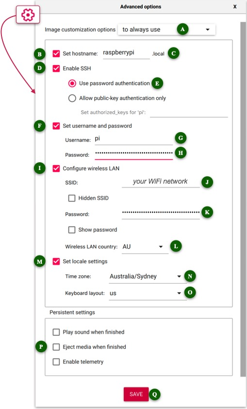

# PiBuilder

* Updated for 2022-04-04 changes to Raspberry Pi OS (second cut)

## <a name="introduction"></a>Introduction

This project documents my approach to building Raspberry Pi operating systems to support [SensorsIot/IOTstack](https://github.com/SensorsIot/IOTstack).

Design goals:

1. To have a reliable, repeatable and auditable approach to building Raspberry Pi OS, primarily as a support platform for [SensorsIot/IOTstack](https://github.com/SensorsIot/IOTstack).
2. As far as possible, to favour **speed** over any need for interaction during the build process.
3. All work done "headless" via ssh.

PiBuilder can't possibly be a "one size fits all" for all possible Raspberry Pi configurations. Of necessity, the scripts and supporting files implement *my* decisions and assumptions. You will almost certainly need to make adjustments for your own situation, and I have tried to make allowances for that by providing a patching system that is flexible and extensible.

I have tested PiBuilder on:

* Raspberry Pi 3B+, 4B and Zero W2 hardware
* 32-bit versions of Raspberry Pi OS (aka Raspbian) "Buster" and "Bullseye"
* 64-bit version of "Bullseye".

The scripts will *probably* work on other Raspberry Pi hardware but I have no idea about other hardware platforms (eg Nuc) or operating systems (eg Debian). I have nothing against either non- Raspberry Pi hardware or operating systems. I can only test with what I have.

## <a name="toc"></a>Contents

- [Definitions](#definitions)
- [Build process summary](#buildProcessSummary)
- [The build process in detail](#buildProcessDetailed)

	- [Download this repository](#downloadRepo)
	- [Download the imaging tool](#downloadTool)
	- [Choose and download a base image](#chooseImage)
	- [Configure and transfer Raspbian image to SD or SSD](#burnImage)
	- [PiBuilder configuration](#configPiBuilder)

		- [Configure installation options](#configOptions)
		- [Configure home directory](#configHome)

			- [Git user configuration](#configGit)

		- [SAMBA support](#sambaSupport)

	- [Run the PiBuilder setup script](#setupPiBuilder)
	- [Boot your Raspberry Pi](#bootRPi)
	- [Run the PiBuilder scripts in order](#runScripts)

		- [Script 01](#runScript01)
		- [Script 02](#runScript02)
		- [Script 03](#runScript03)
		- [Script 04](#runScript04)
		- [Script 05](#runScript05)
		- [Script 06 (optional)](#runScript06)

- [Script summaries](#synopses)

	- [Script 01](#docScript01)
	- [Script 02](#docScript02)
	- [Script 03](#docScript03)
	- [Script 04](#docScript04)
	- [Script 05](#docScript05)
	- [Script 06 (optional)](#docScript06)

- [How PiBuilder scripts search for files, folders and patches](#scriptSearch)

	- [Search function – `supporting_file()`](#searchForItem)
	- [Patch function – `try_patch()`](#searchForPatch)

- [Preparing your own patches](#patchPreparation)

	- [Tools overview: *diff* and *patch*](#patchTools)
	- [Basic process](#patchSummary)
	- [Tutorials](#patchTutorials)

- [Keeping in sync with GitHub](#moreGit)
- [Routine Maintenance](#sysMaintenance)
- [Beware of chickens and eggs](#chickenEgg)

- [Some words about SSH](#aboutSSH)

	- [About `/etc/ssh`](#aboutEtcSSH)
	- [About `~/.ssh`](#aboutDotSSH)
	- [Security of snapshots](#snapshotSecurity)

- [Some words about VNC](#aboutVNC)

- [About Supervised Home Assistant](#hassioBackground)

- [Change Summary](#changeLog)

## <a name="definitions"></a>Definitions

* "your support host" means the system where you have cloned the PiBuilder repository. It will usually be a Mac or PC.
* "`~/PiBuilder`" means the path to the directory where you have cloned the PiBuilder repository from GitHub onto your support host. The directory does not have to be in your home directory on your support host. It can be anywhere.
* "your Raspberry Pi" means the Raspberry Pi device for which you are building an operating system using PiBuilder.
* "«hostname»" is a placeholder meaning "the name you chose for your Raspberry Pi".
* "«username»" is a placeholder meaning "the account name you use to login to your Raspberry Pi".

## <a name="buildProcessSummary"></a>Build process summary

1. [Download this repository](#downloadRepo).
2. [Download the imaging tool](#downloadTool).
3. [Choose and download a Raspbian image](#chooseImage).
4. Use the imaging tool to [configure and transfer the Raspbian image](#burnImage) to your media (SD card or SSD).
5. [Configure PiBuilder](#configPiBuilder).
6. Either run the PiBuilder [`setup_boot_volume.sh`](#setupPiBuilder) script to add installation files to the media, or just copy what's needed by hand.
7. [Move the media to your Raspberry Pi and apply power](#bootRPi).
8. Connect to your Raspberry Pi using SSH and [run the PiBuilder scripts in order](#runScripts).

The end point is a system with IOTstack and all dependencies installed. You can either start building a Docker stack using the IOTstack menu or restore an IOTstack backup.

Please don't be put off by the length of this README document. You can start using PiBuilder without having to worry about any customisations. You will get a Raspberry Pi that is a solid foundation for IOTstack.

Later, when you start to customise your Raspberry Pi, you will realise that you might have trouble remembering all the steps if you ever have to rebuild your Raspberry Pi in a hurry (failed SD card; magic smoke; operator error). That's when the true power of PiBuilder will start to become apparent. You can dig into the how-to when you are ready.

## <a name="buildProcessDetailed"></a>The build process in detail

### <a name="downloadRepo"></a>Download this repository

1. Download this repository from GitHub:

	```bash
	$ git clone https://github.com/Paraphraser/PiBuilder.git ~/PiBuilder
	```

	You don't have to keep the PiBuilder folder in your home directory. It can be anywhere. Just remember the [definition](#definitions) that `~/PiBuilder` always means "the path to the PiBuilder folder on your support host".

2. Create a branch to keep track of your changes:

	```bash
	$ cd ~/PiBuilder
	$ git checkout -b custom
	```

	> You don't have to call your branch "custom". You can choose any name you like.

	A dedicated branch helps you to keep your own changes separate from any changes made to the master version on GitHub, and makes it a bit simpler to manage merging if a change you make conflicts with a change coming from GitHub.

### <a name="downloadTool"></a>Download the imaging tool

I use and recommend [Raspberry Pi Imager](https://www.raspberrypi.com/software/). The instructions below assume you are using Raspberry Pi Imager.

### <a name="chooseImage"></a>Choose and download a base image

The most recent Raspberry Pi OS can always be found at:

* [https://www.raspberrypi.com/software/operating-systems/](https://www.raspberrypi.com/software/operating-systems/)

I always start from "Raspberry Pi OS with desktop" so that is what I recommend.

Images for the Raspberry Pi are downloaded as `.xz` files (previously these were `.zip` files). In all cases, you always have the choice of:

1. downloading the image *directly;* or
2. downloading the image *indirectly* by starting with the `.torrent`.

It is always a good idea to check the SHA256 signature on each image. It gives you assurance that the image has not been tampered with and wasn't corrupted during download. The magic incantation is:

```bash
$ SIGNATURE=«hash»
$ IMAGE=«pathToDownloadedFile»
$ shasum -a 256 -c <<< "$SIGNATURE *$IMAGE"
```

You get the «hash» by clicking the `Show SHA256 file integrity hash` link. Here's an example run:

```bash
$ SIGNATURE=5adcab7a063310734856adcdd2041c8d58f65c185a3383132bc758886528a93d
$ IMAGE=./2022-04-04-raspios-bullseye-arm64.img.xz
$ shasum -a 256 -c <<< "$SIGNATURE *$IMAGE"
./2022-04-04-raspios-bullseye-arm64.img.xz: OK
```

If you don't see "OK", start over!

> If your first attempt was a *direct* download of the image, consider trying the *indirect* method using a torrent.

##### *on the topic of 32- vs 64-bit …*

* "32-bit" systems:

	- Are capable of running both 32-bit and 64-bit kernels. See also the PiBuilder option: [`PREFER_64BIT_KERNEL`](#prefer64BitKernel).
	- User mode is fixed to 32-bit.
	- Docker will pull images built for "arm" architecture.

	The ability to switch kernel modes can come in handy if you find a container misbehaving under a 64-bit kernel.

* "64-bit" systems:

	- Run 64-bit in both kernel and user modes.
	- Docker will pull images built for "arm64" architecture.
	- Installs, looks, feels and behaves like Raspberry Pi OS (Raspbian) but self-identifies as "Debian".

	Once you are running full 64-bit, you have no ability to chop and change.

	Please don't pick a 64-bit image as your starting point for no better reason than "64-bit must be better than 32-bit". PiBuilder will install 64-bit versions of everything, including docker and docker-compose, and Docker will pull "arm64" images when you bring up your stack. Just because something *installs* without error does not guarantee that it will *run* correctly. If you are upgrading from a 32-bit system, you will need to assure yourself that all your containers still work as expected.

### <a name="burnImage"></a>Configure and transfer Raspbian image to SD or SSD

The steps are:

1. Connect your media (SD or SSD) to your support platform (eg Mac/PC). 
2. Launch Raspberry Pi Imager.
3. Click <kbd>CHOOSE OS</kbd>.
4. Scroll down and choose "Use custom".
5. Select the `.xz` (or `.zip`) you downloaded earlier.
6. Click <kbd>CHOOSE STORAGE</kbd>
7. Select the media connected in step 1. *Be careful with this step!*
8. Click the "gear" icon at the bottom, right of the window to open the "Advanced options" panel:

	

	Unless you have good reasons to do otherwise, I recommend:

	- Open the "Image customization options" popup menu [A] and choose "to always use". If you select that option then all of your settings will be remembered across launches of Raspberry Pi Imager. In other words, you will only have to configure Raspberry Pi Imager **once**.

	- Enable [B], then enter a name for your host at <a name="firstBootHostName"></a>[C]. I recommend choosing a generic name rather than a unique name for each host. The decision you make here boils down to:

		- if you choose a *generic* name (like "raspberrypi"), you will only have to set up this panel once. You will choose the actual host name later when you run the first PiBuilder script; but
		- if you choose a *unique* name for each host then you will have to remember to come back into this panel each time you run Raspberry Pi Imager.

		Whatever you decide, you need to follow the rules for domain names:

		- letters ("a".."z", "A".."Z") but lower case is recommended
		- digits ("0".."9")
		- hyphen ("-") **not** underscore

		This documentation uses "«hostname»" to represent the choice you make here.

	- Enable [D] and [E]. This turns on SSH access.
	- Enable [F], then:

		- Enter a username at <a name="firstBootUserName"></a>[G]. You can either stick with the traditional "pi" user or choose a different name. It is tricky to change the username once a system has been built so, if you don't like "pi", you should change it.

			The choice you make here will become the username for *all* of your Raspberry Pis. If you want a different username for each of your Raspberry Pis then you will have to remember to come back into this panel each time you run Raspberry Pi Imager.
			
			This documentation uses "«username»" to represent the choice you make here.

			Note:
			
			* PiBuilder assumes the «username» is "pi". If you choose a different «username» then make sure you follow the [configure home directory](#configHome) instructions. You will need to do that once for each unique «username» you create.

		- Set a strong password at <a name="firstBootUserPassword"></a>[H]. Please don't use the old default password of "raspberry". Although your user password is easy to change later, the PiBuilder 01 script no longer does that for you because it assumes you have already chosen a strong password.

	- <a name="firstBootWiFi"></a>If you want the Raspberry Pi's WiFi interface to be active, enable [I], then:

		- enter your WiFi network name in [J].
		- enter your WiFi password in [K].
		- <a name="firstBootCC"></a>use the popup menu [L] to select your country code.

			> Your support host may pre-populate some or all of these fields.

	- Enable [M] and then use the popup menus <a name="firstBootTZ"></a>[N] and [O] to set appropriate values.
	- Disable [P]. You need to leave the boot partition mounted for the next step.
	- Click [Q] to <kbd>SAVE</kbd> your settings.

9. Click <kbd>WRITE</kbd> and respond to any system prompts to transfer the prepared image to your media.

### <a name="configPiBuilder"></a>PiBuilder configuration

#### <a name="configOptions"></a>Configure PiBuilder installation options

Use a text editor to open:

```
~/PiBuilder/boot/scripts/support/pibuilder/options.sh
```

The file supplied with PiBuilder looks like this:

```bash
# this file is "sourced" in all build scripts.

# - country-code for WiFi
#   normally set in Raspberry Pi Imager - will override if made active
#LOCALCC="AU"

# - local time-zone
#   normally set in Raspberry Pi Imager - will override if made active
#LOCALTZ="Etc/UTC"

# - skip full upgrade in the 01 script.
SKIP_FULL_UPGRADE=false

# - preference for kernel. Only applies to 32-bit installations. If
#   true, adds "arm_64bit=1" to /boot/config.txt
PREFER_64BIT_KERNEL=false

# - preference for handling virtual memory swapping. Three options:
#      VM_SWAP=disable
#         turns off swapping. You should consider this on any Pi
#         that boots from SD.
#      VM_SWAP=automatic
#         changes /etc/dphys-swapfile configuration so that swap size
#         is twice real RAM, with a maximum limit of 2GB. In practice,
#         this will usually result in 2GB of swap space. You should
#         consider this if your Pi boots from SSD.
#      VM_SWAP=default
#         the Raspberry Pi OS defaults apply. In practice, this means
#         swap is enabled and the swap space is 100MB.
#   if VM_SWAP is not defined but the old DISABLE_VM_SWAP=true then
#   that combination is interpreted as VM_SWAP=disable
#VM_SWAP=default

# - default language
#   Whatever you change this to must be in your list of active locales
#   (set via ~/PiBuilder/boot/scripts/support/etc/locale.gen.patch)
#LOCALE_LANG="en_GB.UTF-8"

# - Raspberry Pi ribbon-cable camera control
#   Options are: disabled, "false", "true" and "legacy"
#ENABLE_PI_CAMERA=false

# - override for docker-compose version number. See:
#     https://github.com/docker/compose/releases
#DOCKER_COMPOSE_VERSION="v2.4.1"
# - override for docker-compose architecture. Options are:
#     armv7
#     aarch64
#   armv7 will work on both 32-bit and 64-bit kernels (this is the
#   default) while aarch64 will only work on a 64-bit kernel.
#DOCKER_COMPOSE_ARCHITECTURE="armv7"

#only used if you run the script. These should be kept up-to-date:
#      https://www.sqlite.org/download.html
SQLITEYEAR="2022"
SQLITEVERSION="sqlite-autoconf-3380000"
```

You **can** set the right hand sides of the following variables:

* <a name="localCC"></a>`LOCALCC`to your two-character country code. If enabled, this will override the corresponding value set in [Raspberry Pi Imager](#firstBootCC).
* <a name="localTZ"></a>`LOCALTZ` to a valid country and city combination. If enabled, this will override the corresponding value set in [Raspberry Pi Imager](#firstBootTZ).
* <a name="skipFullUpgrade"></a>`SKIP_FULL_UPGRADE` to `true`. This prevents [Script 01](#docScript01) from performing a "full upgrade", which may be appropriate if you want to test against a base release of Raspberry Pi OS.
* <a name="prefer64BitKernel"></a>`PREFER_64BIT_KERNEL` to `true`. This only applies to 32-bit versions of Raspbian.
* <a name="handleVMswap"></a>`VM_SWAP` to:

	- `disable` to disable virtual memory (VM) swapping to mass storage. This is appropriate if your Raspberry Pi boots from SD **and** has limited RAM.
	- `automatic` changes the swap configuration in `/etc/dphys-swapfile` so that swap size is calculated in two steps. First, the amount of real RAM is doubled (eg a 2GB Raspberry Pi 4 will be doubled to 4GB) and then a maximum limit of 2GB will be applied. This calculation will result in a 2GB swap file for any Raspberry Pi with 1GB or more of real RAM. This is the recommended option if your Raspberry Pi boots from SSD or HD.
	- `default` makes no changes to the virtual memory system. The current Raspberry Pi OS defaults enable virtual memory swapping with a swap file size of 100MB. This is perfectly workable on systems with 4GB of RAM or more.

	If `VM_SWAP` is not set, it defaults to `default`.

	Running out of RAM causes swapping to occur and that, in turn, has both a performance penalty (because SD cards are quite slow) and increases the wear and tear on the SD card (leading to a heightened risk of failure). There are two main causes of limited RAM:

	- Insufficient physical memory. A good example is a Raspberry Pi Zero W2 which only has 512MB to start with; and/or
	- Expecting your Raspberry Pi to do too much work, such as running a significant number of containers which either have large memory footprints, or cause a lot of I/O and consume cache buffers, or both.

	If you disable VM swapping by setting `VM_SWAP` to `disable`, but you later decide to re-enable swapping, run these commands:

	```bash
	$ sudo systemctl enable dphys-swapfile.service
	$ sudo reboot
	```

	You can always check if swapping is enabled using the `swapon -s` command. Silence means swapping is disabled.

	It is important to appreciate that VM swapping is not **bad**. Please don't disable swapping without giving it some thought. If you can afford to add an SSD, you'll get a better result with swapping enabled than if you stick with the SD and disable swapping.

* `LOCALE_LANG` to a valid language descriptor but any value you set here **must** also be enabled via a locale patch. See [setting localisation options](tutorials/locales.md) tutorial. "en_GB.UTF-8" is the default language and I recommend leaving that enabled in any locale patch that you create.
* <a name="enablePiCam"></a>`ENABLE_PI_CAMERA` controls whether the Raspberry Pi ribbon-cable camera support is enabled at boot time.

	- `false` (or undefined) means "do not attempt to enable the camera".
	- `true` means "enable the camera in the mode that is native for the version of Raspberry Pi OS that is running".
	- `legacy`, if the Raspberry Pi is running:
		- *Buster*, then `legacy` is identical to `true`;
		- *Bullseye* the legacy camera system is loaded rather than the native version. In other words, Bullseye's camera system behaves like Buster and earlier. This is the setting to use if downstream applications have not been updated to use Bullseye's native camera system. 

* `DOCKER_COMPOSE_VERSION` is the version of docker-compose to be installed. See the [releases page](https://github.com/docker/compose/releases) for current version numbers. Unfortunately, it is not yet possible to use a generic value like "native". Also note that version numbers begin with the letter "v". In other words, "v2.4.1" is correct while "2.4.1" will fail.
* `DOCKER_COMPOSE_ARCHITECTURE`. Valid values are `armv7` and `aarch64`. [Script 04](#docScript04) chooses `aarch64` if the full 64-bit OS is running, `armv7` otherwise. In essence, if the Raspberry Pi is running a version of Raspberry Pi OS which is *capable* of running in 32-bit user mode, [Script 04](#docScript04) will choose `armv7` irrespective of whether the kernel is running in 32- or 64-bit mode. This variable lets you override that behaviour and force the choice.
* `SQLITEYEAR` and `SQLITEVERSION` let you choose the values which govern the version of SQLite that is installed, if you run the optional [Script 06](#docScript06). See the [releases](https://www.sqlite.org/download.html) page.

##### <a name="perHostConfigOptions"></a>per-host PiBuilder installation options

The file:

```
~/PiBuilder/boot/scripts/support/pibuilder/options.sh
```

contains general options that will be used for **all** of your Raspberry Pis. If you want to create a set of options tailored to the needs of a particular Raspberry Pi, start by making a copy of the general file and append `@` followed by the host name to the copy. For example:

```bash
$ cd ~/PiBuilder/boot/scripts/support/pibuilder
$ cp options.sh options.sh@«hostname»
```

At run time, PiBuilder will give preference to an options file where the `@` suffix matches the name of the host.

#### <a name="configHome"></a>Configure home directory

PiBuilder assumes «username» equals "pi". If you choose a different «username», you *might* need to take special care with the following folder and its contents:

```
~/PiBuilder/boot/scripts/support/home/pi/
```

This is the default structure:

```
└── home
    └── pi
        ├── .config
        │   ├── iotstack_backup
        │   │   └── config.yml
        │   └── rclone
        │       └── rclone.conf
        ├── .gitconfig
        ├── .gitignore_global
        ├── .profile
        └── crontab
```

Let's suppose that, instead of "pi", you decide to use "me" for your «username». What you *might* need to do is make a copy of the "pi" directory, as in:

```
$ cd ~/PiBuilder/boot/scripts/support/home
$ cp -a pi me
```

If you have followed the instructions about creating a custom branch to hold your changes, your next step would be:

```
$ git add me
$ git commit -m "clone default home directory structure"
```

Note:

* This duplication is *optional*, not *essential*. If PiBuilder is not able to find a specific home folder for «username», it falls back to using "pi" as the source of files being copied into the `/home/«username»` folder on your Raspberry Pi.

##### <a name="configGit"></a>Git user configuration

The file at the path:

```
~/PiBuilder/boot/scripts/support/home/«username»/.gitconfig
```

is only a template. It contains:

```
[core]
	excludesfile = ~/.gitignore_global
	pager = less -r
[user]
	name = Your Name
	email = email@domain.com
	signingkey = 04B9CD3D381B574D
[pull]
	rebase = false
```

At the very least, you should:

1. Replace "Your Name"; and
2. Replace "email@domain.com"

If you have not created a key for signing commits, remove the `signingkey` line, otherwise set it to the correct value.

Hint:

* You may find it simpler to replace `.gitconfig` with whatever is in `.gitconfig` in your home directory on your support host.

You should only need to change `.gitconfig` in PiBuilder if you also change `.gitconfig` your home directory on your support host. Otherwise, the configuration can be re-used for all of your Raspberry Pis.

#### <a name="sambaSupport"></a>SAMBA support

PiBuilder can enable SMB services as an option. PiBuilder assumes that you have a working configuration that you want to preserve across rebuilds. If you do not have a working configuration, you need to do that first. You may find the following tutorials helpful:

* KaliTut [Samba on Raspberry Pi Guide – A To Z](https://kalitut.com/samba-on-raspberry-pi/) (April 2021)
* PiMyLifeUp [Raspberry Pi SAMBA](https://pimylifeup.com/raspberry-pi-samba/) (Feb 2021)
* JUANMTECH [SAMBA file sharing](https://www.juanmtech.com/samba-file-sharing-raspberry-pi/) (Oct 2017)

Note:

* Tutorials differ in the packages they tell you to install. You only need:

	```bash
	$ sudo apt install -y samba smbclient
	```

	The `samba` package *includes* `samba-common` and `samba-common-bin` so you do not need to install those separately.

***After*** you have SAMBA working on your Raspberry Pi, you need to preserve three files:

1. Your configuration:

	```bash
	$ cp /etc/samba/smb.conf $HOME
	```

2. Any SAMBA credentials you may have set up:

	```bash
	$ touch $HOME/passdb.tdb
	$ sudo cp /var/lib/samba/private/passdb.tdb $HOME/passdb.tdb
	```

3. Host-specific information generated when SAMBA is first installed on any given host:

	```bash
	$ touch $HOME/secrets.tdb@$HOSTNAME
	$ sudo cp /var/lib/samba/private/secrets.tdb $HOME/secrets.tdb@$HOSTNAME
	```

	`@HOSTNAME` syntax is used because `secrets.tdb` contains *host-specific* information. While you may use common `smb.conf` and `passdb.tdb` files on several hosts, you should obtain `secrets.tdb` from the host on which it was created. 

Next, navigate to the top level of your copy of PiBuilder and create two directories:

```bash
$ cd ~/PiBuilder
$ mkdir -p boot/scripts/support/etc/samba boot/scripts/support/var/lib/samba/private
```

Finally:

1. Move `smb.conf` into `~/PiBuilder/boot/scripts/support/etc/samba`; and
2. Move the `.tdb` files into `~/PiBuilderboot/scripts/support/var/lib/samba/private`.

When the 03 script runs, it detects the presence of `smb.conf` and uses it as a trigger to:

1. Install SAMBA;
2. Replace the default versions of the three files with your custom versions; and
3. Create `$HOME/share` as a home for your SMB mount points.

### <a name="setupPiBuilder"></a>Run the PiBuilder setup script

Re-insert the media so the "boot" volume mounts. Run:

```bash
$ cd ~/PiBuilder
$ ./setup_boot_volume.sh «path-to-mount-point»
```

If your support platform is a Mac you can omit `«path-to-mount-point»` because it defaults to `/Volumes/boot`. 

I have tried to make this a generic script but I don't have the ability to test it on Windows. If the script does not work on your system, you can emulate it as follows:

1. Notice that the `~/PiBuilder/boot` folder contains a folder named `scripts`.

	> it used to also contain an empty file named `ssh` plus a file named `wpa_supplicant.conf` which you were expected to configure; those files have not been needed since the 2022-04-04 changes to Raspberry Pi OS.

2. Copy `scripts` from `~/PiBuilder/boot` to the top level of the `boot` volume.
3. Eject the media.

Note:

* If you are starting from a 32-bit base image, don't activate the 64-bit kernel by hand. The simplest way to get a combined 64-bit kernel plus 32-bit user mode is to enable the [`PREFER_64BIT_KERNEL`](#prefer64BitKernel) option and let PiBuilder do it for you.

### <a name="bootRPi"></a>Boot your Raspberry Pi

Transfer the media to your Raspberry Pi and apply power.

A Raspberry Pi normally takes 20-30 seconds to boot. However, the first time you boot from a clean image it takes a bit longer (a minute or so). The longer boot time is explained by one-time setup code, such as generating host keys for SSH and expanding the root partition to fully occupy the available space on your media (SD or SSD). Be patient.

You will know your Raspberry Pi is ready when it starts responding to pings:

```bash
$ ping -c 1 «hostname».local
```

Your Raspberry Pi should be reachable on:

* `«hostname».local` – its multicast DNS name;
* `«hostname».your.domain.com` – if you have done the necessary work with local DHCP and DNS servers;
* `«hostname»` – either implicitly because `.your.domain.com` is assumed and the above applies, or because you have added an entry to `/etc/hosts` on your support host; or 
* your Raspberry Pi's IP address(es) – one IP address per interface if both Ethernet and WiFi are active.

These instructions assume you will use the multicast DNS name (ie `«hostname».local`) but you can substitute the other forms if those make more sense in your environment. 

### <a name="runScripts"></a>Run the PiBuilder scripts in order

#### <a name="runScript01"></a>Script 01

When your Raspberry Pi responds to pings, connect to it like this:

```bash
$ ssh-keygen -R «hostname».local
$ ssh -4 «username»@«hostname».local
```

Notes:

* The `ssh-keygen` command is protective and removes any obsolete information from your "known hosts" file. Ignore any errors.
* The `-4` parameter on the `ssh` command instructs SSH to stick to IPv4.

Normally, SSH will issue a challenge like this:

```
The authenticity of host '«description»' can't be established.
ED25519 key fingerprint is SHA256:gobbledegook/gobbledegook.
Are you sure you want to continue connecting (yes/no)? 
```

This is sometimes referred to as <a name="tofudef"></a>the TOFU (Trust On First Use) pattern. Respond with:

```
yes
```

Your Raspberry Pi will ask for the password for the user «username».

Now it is time to run the first script:

```bash
$ /boot/scripts/01_setup.sh {newhostname}
```

Note:

* <a name="newHostname"></a>`newhostname` is an optional parameter. If you supply an argument here, it overrides the value of [«hostname» set in Raspberry Pi Imager](#firstBootHostName) and becomes the «hostname». Any name you supply here must follow the same rules (letters, digits, hyphens).

The 01 script runs to completion and reboots your Raspberry Pi. Rebooting disconnects your SSH session, returning you to your support host.

If the last part of the script prompts you to do so, run the command:

```bash
$ ssh-keygen -R «hostname».local 
```

#### <a name="runScript02"></a>Script 02

You will know your Raspberry Pi is ready when it starts responding to pings:

```bash
$ ping -c 1 «hostname».local
```

Connect and login:

```bash
$ ssh -4 «username»@«hostname».local
```

If you see the [TOFU pattern](#tofudef) again, respond with "yes". Then run:

```bash
$ /boot/scripts/02_setup.sh
```

The 02 script runs to completion and reboots your Raspberry Pi. It is quite a quick script so don't be surprised or think it hasn't done anything.

The 02 script also disables IPv6 so, from this point onwards, you can omit the `-4` parameter from SSH commands.

#### <a name="runScript03"></a>Script 03

Connect and login:

```bash
$ ssh «username»@«hostname».local
```

Run:

```bash
$ /boot/scripts/03_setup.sh
```

A common problem with this script is the error "Unable to connect to raspbian.raspberrypi.org". This seems to be transient but it also happens far more frequently than you would like or expect. The script attempts to work around this problem by processing each package individually, while keeping track of packages that could not be installed. Then, if there were any packages that could not be installed, the script:

- displays a list of the failed packages;
- invites you to try running the failed installations by hand; and
- asks you to re-run 03_setup.sh (which will skip over any packages that are already installed).

The 03 script ends with a logout (not a reboot) so you can login again immediately.

#### <a name="runScript04"></a>Script 04

Connect and login:

```bash
$ ssh «username»@«hostname».local
```

Run:

```bash
$ /boot/scripts/04_setup.sh
```

#### <a name="runScript05"></a>Script 05

Once your Raspberry Pi comes back, login using:

```bash
$ ssh «username»@«hostname».local
```

Run:

```bash
$ /boot/scripts/05_setup.sh
```

That ends in a logout. Login again.

At this point, your Raspberry Pi is ready to run IOTstack. You can either restore a backup or go into the IOTstack menu and start choosing your containers:

```bash
$ cd ~/IOTstack
$ ./menu.sh
``` 

#### <a name="runScript06"></a>Script 06 (optional)

This script is entirely optional. It rebuilds SQLite from source code. The version of SQLite you get from `apt install` doesn't have all the features you might expect if SQLite is your thing.

If you have no plans to run SQLite and/or don't need its more advanced features, just skip this step.

It is also OK to defer running this script until you have an actual need:

```bash
$ /boot/scripts/06_setup.sh
```  

## <a name="synopses"></a>Script summaries

Every script has the same basic scaffolding:

* source the common functions from `/boot/scripts/support/pibuilder/functions.sh`
* invoke `run_pibuilder_prolog` which:
	- sources the [installation options](#configOptions) from either:

		- `/boot/scripts/support/pibuilder/options.sh@$HOSTNAME` or
		- `/boot/scripts/support/pibuilder/options.sh`

	- sources a script-specific user-defined prolog, if one exists
* perform the installation steps defined in the script
* invoke `run_pibuilder_epilog` which sources a script-specific user-defined epilog, if one exists
* either reboot your Raspberry Pi or logout, as is appropriate.

> When used in the context of shell scripts, the words "*source*", "*sourcing*" and "*sourced*" mean that the associated file is processed, inline, as though it were part of the original calling script. It is analogous to an "include" file.

### <a name="docScript01"></a>Script 01

The script:

* Assumes fresh install of Raspberry Pi OS.
* Snapshots baseline references as follows:

	- `/etc` as `/etc-baseline` 
	- `/boot/cmdline.txt` as `/boot/cmdline.txt.baseline`
	- `/boot/config.txt` as `/boot/config.txt.baseline`

* Initialises `~/.ssh` and `~/.gnupg` directories with correct permissions (700).
* Ensures `~/.local/bin` exists.
* If the operating system is Raspbian Buster, adds support for fetching `libseccomp2` as a backport (needed for Alpine-based Docker images).
* Runs an OS update.
* Runs an OS full-upgrade followed by an autoremove unless [`SKIP_FULL_UPGRADE`](#skipFullUpgrade) is `true`.
* Optionally replaces `/etc/ssh` with a preset.
* Optionally sets up locale(s).
* Optionally enables the 64-bit kernel (see [`PREFER_64BIT_KERNEL`](#prefer64BitKernel)).
* Optionally enables the Raspberry Pi ribbon-cable camera (see [`ENABLE_PI_CAMERA`](#enablePiCam)).
* Sets raspi-config options:

	- boot to console
	- WiFi country code  (if [`LOCALCC`](#localCC) is enabled)
	- TimeZone  (if [`LOCALTZ`](#localTZ) is enabled)

* Optionally changes «hostname» (if [newhostname](#newHostname) argument is provided)
* Reboots

### <a name="docScript02"></a>Script 02

The script:

* Cleans up any leftovers from `/etc/ssh` replacement.
* Optionally sets up default language for your locale.
* Applies the recommended `allowinterfaces eth*,wlan*` patch.
* Applies [Does your Raspberry Pi's Wireless Interface freeze?](https://gist.github.com/Paraphraser/305f7c70e798a844d25293d496916e77). Only probes interfaces that are defined, are active, and obtain their IP addresses via DHCP.
* Optionally sets up local DNS.
* Disables IPv6.
* Alters `/etc/systemd/journald.conf` to reduce endless docker-runtime mount messages.
* Optionally changes virtual memory swapping (see [`VM_SWAP `](#handleVMswap)).
* Reboots.

### <a name="docScript03"></a>Script 03

The script:

* If the operating system is Raspbian Buster, installs `libseccomp2` as a backport (needed for Alpine-based Docker images).
* Installs add-on packages (IOTstack dependencies and useful tools including crypto support).
* Optionally installs [SAMBA support](#sambaSupport).
* Makes Python3 the default.
* Optionally sets up Network Time Protocol sync with local time-servers. See [Configuring Raspbian to use local time-servers](https://gist.github.com/Paraphraser/e1129880015203c29f5e1376c6ca4a08).
* Installs any custom UDEV rules in `/etc/udev/rules.d`.
* Clones [SensorsIot/IOTstack](https://github.com/SensorsIot/IOTstack) to `~/IOTstack`.
* Clones [IOTstackAliases](https://github.com/Paraphraser/IOTstackAliases) to `~/.local/IOTstackAliases`.
* Installs `rclone` and `niet` packages (IOTstackBackup dependencies).
* Clones [IOTstackBackup](https://github.com/Paraphraser/IOTstackBackup) to `~/.local/IOTstackBackup` and installs scripts in `~/.local/bin`.
* Adds `mkdocs` support. With that in place, you can do:

	```bash
	$ cd ~/IOTstack
	$ mkdocs serve -a «ipaddress»:«port»
	```

	where «ipaddress» is the IP address of your Raspberry Pi, and «port» is a port not otherwise in use (eg 9780). Then, from another host you can point your browser at:

	```
	http://«ipaddress»:«port»
	```

	and see the Wiki view of the IOTstack documentation.

* Ends with a logout.

### <a name="docScript04"></a>Script 04

The script:

* Installs Docker.
* Sets up the `docker` and `bluetooth` group memberships assumed by IOTstack.
* Installs Docker-Compose.
* Installs the `ruamel.yaml` and `blessed` Python dependencies assumed by IOTstack.
* Appends directives to `/boot/cmdline.txt`:

	- `cgroup_memory=1 cgroup_enable=memory` (so `docker stats` will report memory utilisation)

* Reboots.

### <a name="docScript05"></a>Script 05

The script:

* Replaces `~/.profile`.
* Initialises crontab (scaffolding only; does nothing).
* Sets up Git scaffolding (`.gitconfig` and `.gitignore_global`).
* Copies placeholder configuration files for `rclone` and IOTstackBackup into `~/.config`
* Erases bash history.
* Ends with a logout.

### <a name="docScript06"></a>Script 06 (optional)

This script is optional. It rebuilds SQLite from source code. The version you get from `apt install` doesn't have all the features you might want.

## <a name="scriptSearch"></a>How PiBuilder scripts search for files, folders and patches

### <a name="searchForItem"></a>Search function – `supporting_file()`

PiBuilder's search function is called `supporting_file()`. Despite the name, it can search for both files and folders.

`supporting_file()` takes a single argument which is always a path beginning with a `/`. In this context, the leading `/` means "the `support` directory".

On your support host (Mac/PC), the `support` directory is at the path:

```
~/PiBuilder/boot/scripts/support
```

When you [run the PiBuilder setup script](#setupPiBuilder), the `scripts` folder and its contents are copied to the `boot` partition. When the media is mounted on your Raspberry Pi, the absolute path to the `support` directory is:

```
/boot/scripts/support
```

That path is the starting point for all searching. Suppose a script invokes:

```bash
$ supporting_file "/etc/resolv.conf"
```

The `supporting_file()` function first prepends the absolute path to the support directory on your Raspberry Pi, which results in:

```
/boot/scripts/support/etc/resolv.conf
```

That path is considered the *general* path.

The `supporting_file()` function also prepares a *host-specific* path by appending `@` plus the `$HOSTNAME` environment variable. For example:

```
/boot/scripts/support/etc/resolv.conf@«hostname»
```

If the *host-specific* path exists, the *general* path is ignored. The *general* path is only used if the *host-specific* path does not exist.

If whichever path emerges from the preceding step:

* is a file of non-zero length; **or**
* is a folder containing at least one visible component (file or sub-folder),

then `supporting_file()` returns that path and sets its result code to mean that the path can be used. Otherwise the result code is set to mean that no path was found.

In most cases, `supporting_file()` is used like this:

```bash
TARGET="/etc/resolv.conf"
if SOURCE="$(supporting_file "$TARGET")" ; then
   
   # do something like copy $SOURCE to $TARGET

fi
``` 

### <a name="searchForPatch"></a>Patch function – `try_patch()`

The `try_patch()` function takes two arguments:

1. A path beginning with a `/` where the `/` means "the `support` directory".
2. A comment string summarising the purpose of the patch.

For example:

```bash
try_patch "/etc/resolv.conf" "this is an example"
```

The patch algorithm appends `.patch` to the path supplied in the first argument and then invokes `supporting_file()`:

```bash
supporting_file "/etc/resolv.conf.patch"
``` 

Calling `supporting_file()` implies two candidates will be considered:

```
/boot/scripts/support/etc/resolv.conf.patch@«hostname»
/boot/scripts/support/etc/resolv.conf.patch
``` 

The *host-specific* form is given precedence over the *general* form.

If `supporting_file()` returns a candidate, the patching algorithm will assume it is a valid patch file and attempt to apply it to the target file. It sets its result code to mean "success" if and only if the patch was applied.

The `try_patch()` function has two common use patterns:

* unconditional invocation where there are no actions that depend on the success of the patch. For example:

	```bash
	try_patch "/etc/dhcpcd.conf" "allowinterfaces eth*,wlan*"
	``` 

* conditional invocation where subsequent actions depend on the success of the patch. For example:

	```bash
	if try_patch "/etc/locale.gen" "setting locales (ignore errors)" ; then
		sudo dpkg-reconfigure -f noninteractive locales
	fi
	```

## <a name="patchPreparation"></a>Preparing your own patches

PiBuilder can *apply* patches for you, but you still need to *create* each patch.

### <a name="patchTools"></a>Tools overview: *diff* and *patch*

Understanding how patching works will help you to develop and test patches before handing them to PiBuilder. Assume:

1. an «original» file (the original supplied as part of Raspbian); and
2. a «final» file (after your editing to make configuration changes).

To create a «patch» file, you use the `diff` tool which is part of Unix:

```bash
$ diff «original» «final» > «patch»
```

Subsequently, given:

1. a fresh Raspbian install where only «original» exists; plus
2. your «patch» file,

you use the `patch` tool which is also part of Unix:

```bash
$ patch -bfnz.bak -i «patch» «original»
```

That `patch` command will:

1. copy «original» to «original».bak; and
2. apply «patch» to «original» to convert it to «final».

### <a name="patchSummary"></a>Basic process

The basic process for creating a patch file for use in PiBuilder is:

1. Make sure you have a baseline version of the file you want to change. The baseline version of a «target» file should always be whatever was in the Raspbian image you downloaded from the web. Typically, there are two situations:

	* You have run PiBuilder and PiBuilder has already applied a patch to the «target» file. In that case, `«target».bak` is a copy of whatever was in the Raspbian image you downloaded from the web. That means `«target».bak` is your baseline and you don't need to do anything else.
	* The «target» file has never been changed. The currently-active file is your baseline so you need to preserve it by making a copy before you start changing anything. The most likely place where you will be working is the `/etc` directory so `sudo` is usually appropriate:

		```bash
		$ sudo cp «target» «target».bak
		```

	Note:

	* One of PiBuilder's first actions in the 01 script is to make a copy of `/etc` as `/etc-baseline`. PiBuilder does this before it makes any changes. If you make some changes in the `/etc` directory and only then realise that you forgot to save a baseline copy, you can always fetch a copy of the original file from `/etc-baseline`. 

2. Make whatever changes you need to make to the «target». Sometimes this will involve using `sudo` and a text editor. Other times, you will be able to run a configuration tool like `raspi-config` and it will change the «target» file(s) for you.
3. Create a «patch» file using the `diff` tool. For any given patch file, you always have two options:

	* If the patch file should apply to a **specific** Raspberry Pi, generate the patch file like this:

		```bash
		$ diff «target».bak «target» > «target».patch@$HOSTNAME
		```

	* If the patch file should apply to **all** of your Raspberry Pis each time they are built, generate the patch file like this:

		```bash
		$ diff «target».bak «target» > «target».patch
		```

	You can do both. A *host-specific* patch always takes precedence over a *general* patch.

4. Place the «patch» file in its proper location in the PiBuilder structure on your support host.

	For example, suppose you have prepared a patch that will be applied to the following file on your Raspberry Pi:

	```
	/etc/resolvconf.conf
	```

	Remove the file name, leaving the path component:

	```
	/etc
	```

	The path to the support folder in your PiBuilder structure on your support host is:

	```
	~/PiBuilder/boot/scripts/support
	```

	Append the path component ("`/etc`") to the path to the support folder:

	```
	~/PiBuilder/boot/scripts/support/etc
	```

	That folder is where your patch files should be placed. The patch file you prepared will have one of the following names:

	```
	resolvconf.conf.patch@«hostname»
	resolvconf.conf.patch
	```

	The proper location for the patch file in the PiBuilder structure structure on your support host is one of the following paths:

	```
	~/PiBuilder/boot/scripts/support/etc/resolvconf.conf.patch@«hostname»
	~/PiBuilder/boot/scripts/support/etc/resolvconf.conf.patch
	```

### <a name="patchTutorials"></a>Tutorials

PiBuilder already has "hooks" in place for some common situations. All you need to do is prepare a patch file and PiBuilder will apply it the next time you build an operating system:

* [Setting localisation options](tutorials/locales.md)
* [Setting Domain Name System servers](tutorials/dns.md)
* [Setting your closest Network Time Protocol servers](tutorials/ntp.md)
* [Setting up static IP addresses for your Raspberry Pi](tutorials/ip.md)

The next tutorial covers a situation where PiBuilder does not have a "hook". It explains how to prepare the patches, how to add them to your PiBuilder structure, and how to hook the patches into the PiBuilder process using a script epilog:

* [Restoring Buster-style log rotation for syslog](tutorials/logrotate.md)

## <a name="moreGit"></a>Keeping in sync with GitHub

The instructions in [download this repository](#downloadRepo) recommended that you create a Git branch ("custom") to hold your customisations. If you did not do that, please do so now:

```bash
$ cd ~/PiBuilder
$ git checkout -b custom
```

Notes:

* any changes you may have made *before* creating the "custom" branch will become part of the "custom" branch. You won't lose anything. After you "add" and "commit" your changes on the "custom" branch, the "master" branch will be a faithful copy of the PiBuilder repository on GitHub at the moment you first cloned it.
* once the "custom" branch becomes your working branch, there should be no need to switch branches inside the PiBuilder repository. The instructions in this section assume you are always in the "custom" branch.

From time to time as you make changes, you should run:

```bash
$ git status
```

Add any new or modified files or folders using:

```bash
$ git add «path»
```

Note:

* You can't add an empty folder to a Git repository. A folder must contain at least one file before Git will consider it for inclusion.

Whenever you reach a logical milestone, commit your changes:

```bash
$ get commit -m "added a patch for something or other"
```

> naturally, you will want to use a far more informative commit message!

Periodically, you will want to check for updates to PiBuilder on GitHub:

```bash
$ git fetch origin master:master
```

That pulls changes into the master branch. Next, you will want to merge those changes into your "custom" branch:

```bash
$ git merge master --no-commit
```

If the merge:

* succeeds, you will see:

	```
	Automatic merge went well; stopped before committing as requested
	```

* is blocked before it completes, you will see one or more messages like this:

	```
	CONFLICT (content): Merge conflict in «filename»
	```

	That tells you that the problem is in «filename». For each file mentioned in such a message:

	1. Open the file using your favourite text editor.
	2. Search for `<<<<<<<`. You are looking for a pattern like this:

		```
		<<<<<<< HEAD
		one or more lines of your own text
		=======
		one or more lines of text coming from PiBuilder on GitHub
		>>>>>>> master
		```

	3. To resolve the conflict, you just need to decide what the file should look like and remove the conflict markers:

		* If you want to preserve your own text and discard the PiBuilder lines, reduce the above to just:

			```
			one or more lines of your own text
			```

		* If you want the lines coming from the PiBuilder to replace your own, reduce the above to just:

			```
			one or more lines of text coming from PiBuilder on GitHub
			```

		* If you want to preserve material from both:

			```
			one or more lines of your own text
			one or more lines of text coming from PiBuilder on GitHub
			```

			or:

			```
			one or more lines of my own text merged with one or more lines from GitHub
			```

	4.	Don't forget that a file may have more than one area of conflict so go back to step 2 and repeat the search until you are sure all the conflicts have been found and resolved.
	5. Once you are sure you have resolved all of the conflicts in a file, tell `git` by:

		```bash
		$ git add «filename»
		```

	5. If more than one file was marked as being in conflict, start over from step 1. You can always refresh your memory on which files are still in conflict by:

		```bash
		$ git status

		…
		Changes to be committed:
			modified:   file1.txt

		Unmerged paths:
			both modified:   file2.txt
		…
		```

		In the above, `file1.txt` is no longer in conflict but `file2.txt` still needs to be checked.

It does not matter whether the merge succeeded immediately or if it was blocked and you had to resolve conflicts, the next step is to run:

```bash
$ git status
``` 

For each file mentioned in the status list that is not in the "Changes to be committed" list, run:

```bash
$ git add «filename»
```

The last step is to commit the merged changes to your own branch:

```bash
$ git commit -m "merged with GitHub updates"
```

Now you are in sync with GitHub.

## <a name="sysMaintenance"></a>Routine Maintenance

Read [Maintaining docker + docker-compose](reinstallation.md) if you need to upgrade or reinstall either/both docker and docker-compose.

## <a name="chickenEgg"></a>Beware of chickens and eggs

Installing and configuring software on a Raspberry Pi (or any computer) involves quite a few chicken-and-egg situations. For example:

* Until you decide to install [IOTstackBackup](https://github.com/Paraphraser/IOTstackBackup), you:

	- May not have had a need to install `rclone`
	- May not have had to configure `rclone` to use Dropbox as a remote
	- Will not have had to think about configuring `iotstack_backup`.

* If you decide to install IOTstackBackup then you will need to think about all those things.
* Once you have obtained an "app key" for Dropbox, have established an `rclone` remote to talk to Dropbox, and have configured IOTstackBackup to use that remote, you will expect to be able to take backups, and then restore those backups on your Raspberry Pi. And you will!
* … until you rebuild your Raspberry Pi. To be able to restore after a rebuild, you **must** have the `rclone` and `iotstack_backup` configurations in place. You either need to:

	- recreate those by hand (and obtain a new Dropbox app key), or
	- recover them from somewhere else (eg another Raspberry Pi) or, *best of all*
	- make sure they are in the right place for PiBuilder to be able to copy them into place automatically at the right time.

* This repo assumes the last option: you have saved the `rclone` and `iotstack_backup` configuration files into the proper location in the `support` directory:

	```
	~/PiBuilder/boot/scripts/support/home/«username»/.config/
	├── iotstack_backup
	│   └── config.yml
	└── rclone
	    └── rclone.conf
	```

* Of course, in order to have saved those configurations into the proper location, you will first have had to have set them up and tested them.

Chicken-and-egg!

There is no substitute for thinking, planning and testing.

## <a name="aboutSSH"></a>Some words about SSH

### <a name="aboutEtcSSH"></a>About `/etc/ssh`

Whenever you start from a clean Raspberry Pi OS image, the very first boot-up initialises:

```
/etc/ssh
```

The contents of that folder can be thought of as a unique identity for the SSH service on your Raspberry Pi. That "identity" can be captured by: 

```bash
$ cd
$ /boot/scripts/helpers/etc_ssh_backup.sh
```

Suppose your Raspberry Pi has the name "iot-hub". The result of running that script will be:

```
~/etc-ssh-backup.tar.gz@iot-hub
```

If you copy that file into your PiBuilder folder at path:

```
~/PiBuilder/boot/scripts/support/etc/ssh/
```

and then run `setup_boot_volume.sh`, the `etc-ssh-backup.tar.gz@iot-hub` will be copied onto the `boot` volume along with everything else.

When you boot your Raspberry Pi and run:

```bash
$ /boot/scripts/01_setup.sh
``` 

the script will search for `etc-ssh-backup.tar.gz@iot-hub` and, if found, will use it to restore `/etc/ssh` as it was at the time the snapshot was taken. In effect, you have given the machine its original SSH identity.

The contents of `/etc/ssh` are not tied to the physical hardware so if, for example, your "live" Raspberry Pi emits magic smoke and you have to repurpose your "test" Raspberry Pi, you can cause the replacement to take on the SSH identity of the failed hardware.

> Fairly obviously, you will still need to do things like change your DHCP server so that the working hardware gets the IP address(es) of the failed hardware, but the SSH side of things will be in place.

Whether you do this for any or all of your hosts is entirely up to you. I have gone to the trouble of setting up SSH certificates and it is a real pain to have to run around and re-sign the host keys every time I rebuild a Raspberry Pi. It is much easier to set up `/etc/ssh` **once**, then take a snapshot, and re-use the snapshot each time I rebuild.

If you want to learn how to set up password-less SSH access, see [IOTstackBackup SSH tutorial](https://github.com/Paraphraser/IOTstackBackup/blob/master/ssh_tutorial.md). Google is your friend if you want to go the next step and set up SSH certificates.

### <a name="aboutDotSSH"></a>About `~/.ssh`

The contents of `~/.ssh` carry the client identity (how «username» authenticates to target hosts), as distinct from the machine identity (how your Raspberry Pi proves itself to clients seeking to connect).

Personally, I use a different approach to maintain and manage `~/.ssh` but it is still perfectly valid to run the supplied:

```bash
$ /boot/scripts/helpers/user_ssh_backup.sh
``` 

and then restore the snapshot in the same way as Script 01 does for `/etc/ssh`. I haven't provided a solution in PiBuilder. You will have to come up with that for yourself.

### <a name="snapshotSecurity"></a>Security of snapshots

There is an assumption that it is "hard" for an unauthorised person to gain access to `etc/ssh` and, to a lesser extent, `~/.ssh`. How "hard" that actually is depends on a lot of things, not the least of which is whether you are in the habit of leaving terminal sessions unattended...

Nevertheless, it is important to be aware that the snapshots do contain sufficient information to allow a third party to impersonate your hosts so it is probably worthwhile making some attempt to keep them reasonably secure.

I keep my snapshots on an encrypted volume. You may wish to do the same.

## <a name="aboutVNC"></a>Some words about VNC

PiBuilder disables VNC. To understand why, and to find instructions on how to enable VNC, please see:

* [VNC + PiBuilder](tutorials/vnc.md)

## <a name="hassioBackground"></a>About Supervised Home Assistant

> The information below has been added to [IOTstack Pull Request 528](https://github.com/SensorsIot/IOTstack/pull/528) and should appear in the IOTstack documentation for Home Assistant once that Pull Request has been approved and applied.

IOTstack used to offer a menu entry leading to a convenience script that could install Supervised Home Assistant. That script stopped working when Home Assistant changed their approach. The script's author [made it clear](https://github.com/Kanga-Who/home-assistant/blob/master/Supervised%20on%20Raspberry%20Pi%20with%20Debian.md) that script's future was bleak so the affordance was [removed from IOTstack](https://github.com/SensorsIot/IOTstack/pull/493).

For a time, you could manually install Supervised Home Assistant using their [installation instructions for advanced users](https://github.com/home-assistant/supervised-installer). Once you got HA working, you could install IOTstack, and the two would (mostly) happily coexist.

The direction being taken by the Home Assistant folks is to supply a [ready-to-run image for your Raspberry Pi](https://www.home-assistant.io/installation/raspberrypi). They still support the installation instructions for advanced users but the [requirements](https://github.com/home-assistant/architecture/blob/master/adr/0014-home-assistant-supervised.md#supported-operating-system-system-dependencies-and-versions) are very specific. In particular:

> Debian Linux Debian 11 aka Bullseye (no derivatives)

Raspberry Pi OS is a Debian *derivative* and it is becoming increasingly clear that the "no derivatives" part of that requirement must be taken literally and seriously. Recent examples of significant incompatibilities include:

* [introducing a dependency on `grub` (GRand Unified Bootloader)](https://github.com/home-assistant/supervised-installer/pull/201). The Raspberry Pi does not use `grub` but the change is actually about forcing Control Groups version 1 when the Raspberry Pi uses version 2.
* [unilaterally starting `systemd-resolved`](https://github.com/home-assistant/supervised-installer/pull/202). This is a DNS resolver which claims port 53. That means you can't run your own DNS service like PiHole, AdGuardHome or BIND9 as an IOTstack container. 

Because of the self-updating nature of Supervised Home Assistant, your Raspberry Pi might be happily running Supervised Home Assistant plus IOTstack one day, and suddenly start misbehaving the next day, simply because Supervised Home Assistant assumed it was in total control of your Raspberry Pi.

If you want Supervised Home Assistant to work, reliably, it really needs to be its own dedicated appliance. If you want IOTstack to work, reliably, it really needs to be kept well away from Supervised Home Assistant. If you want both Supervised Home Assistant and IOTstack, you really need two Raspberry Pis.

## <a name="changeLog"></a>Change Summary

* 2022-05-09

	- Deprecate `DISABLE_VM_SWAP` in favour of `VM_SWAP` with the choices:

		-  `disable` is the same as `DISABLE_VM_SWAP=true`
		-  `default` is the same as `DISABLE_VM_SWAP=false`
		-  `automatic` will generally result in a 2GB swap file (up from the 100MB default). 

* 2022-05-06

	- All docker, docker-compose maintenance activities (remove, re-install, upgrade) moved to [Maintaining docker + docker-compose](reinstallation.md).

* 2022-05-02

	- Bump docker-compose to v2.5.0
	- Switch from `curl` to `wget` for docker-compose downloads (slightly better error-handling)

* 2022-04-13

	- consolidate dependencies on `/boot/scripts/support/home/pi` into the 05 script.
	- 05 script now checks for `/boot/scripts/support/home/$USER`. If that path does not exist, the script substitutes `/boot/scripts/support/home/pi`. This will avoid the need to duplicate the "pi" home folder structure for each distinct «username».
	- 03 script now does protective creation of `$HOME/IOTstack/backups` and `$HOME/IOTstack/services`. This prevents `docker-compose` from creating those folders with root ownership. Follows-on from a question on Discord.
	- Moves `mkdocs` setup to 03 script.

* 2022-04-12

	- Adapt to [2022-04-04 changes](https://downloads.raspberrypi.org/raspios_arm64/release_notes.txt) made by Raspberry Pi Foundation (no "pi" user, no default password, etc).
	- Null `ssh` file removed from boot folder (now set in Raspberry Pi Imager). Creating `/boot/ssh` still works and has the expected effect of enabling SSH.
	- `wpa_supplicant.conf` template removed from boot folder (now set in Raspberry Pi Imager). Adding `/boot/wpa_supplicant.conf` still works and has the expected effect of enabling WiFi but Raspberry Pi Imager goes to the trouble of masking the WiFi PSK so it's a better choice. 
	- PiBuilder options changed - `LOCALCC` and `LOCALTZ` default to commented-out. These values should be set in Raspberry Pi Imager. Enabling `LOCALCC` and/or `LOCALTZ` still works and still has the expected effect.
	- VNC changes:

		- password support moved out of 01 Script to `set_vnc_password.sh` helper script.
		- `common.custom` template removed from support structure (embedded in `set_vnc_password.sh`)
		- vnc.md tutorial updated to explain use of `set_vnc_password.sh` script.

	- other 01 script changes:

		- hostname parameter now optional. If invoked as:

			```
			/boot/scripts/01_setup.sh
			```
			
			then HOSTNAME will not change. If invoked as:
			
			```
			/boot/scripts/01_setup.sh newhostname
			```
			
			then HOSTNAME will change if and only if newhostname is different.
			
		- user password change no longer enforced (assumes a strong password set in Raspberry Pi Imager).

	- `/boot/scripts/support` is no longer assumed. Path to `support` directory is now discovered dynamically, relative to `0x_setup.sh` script.

* 2022-04-09

	- Fix `/home/pi` assumption in crontab template. Also expands template to provide a lot more inline help text. 

* 2022-04-06

	- Withdraw all support for Supervised Home Assistant. See [About Supervised Home Assistant](#hassioBackground) for more information.

* 2022-04-05

	- Workaround for [PiBuilder issue 4](https://github.com/Paraphraser/PiBuilder/issues/4) / [HA issue 207](https://github.com/home-assistant/supervised-installer/issues/207). Manifests in 04 script as:

		```
		cp: cannot stat '/etc/default/grub': No such file or directory
		```

		Related info:
		 
		* [HA issue 3444](https://github.com/home-assistant/supervisor/issues/3444)
		* [HA PR 201](https://github.com/home-assistant/supervised-installer/pull/201)
		* [HA PR 206](https://github.com/home-assistant/supervised-installer/pull/206)

	- Bump docker-compose to v2.4.1

* 2022-03-15

	- Add instructions for enabling VNC

* 2022-03-10

	- Bump docker-compose to v2.3.3 (this version supports `device_cgroup_rules` - see [PR9251](https://github.com/docker/compose/pull/9251))
	- Rename `SKIP_FULL_UPDATE` to `SKIP_FULL_UPGRADE`.
	- Document `SKIP_FULL_UPGRADE`.
	- Add `ENABLE_PI_CAMERA` documentation.
	- Remove recommendation to stick with Buster for camera support.
	- Update SQLite version numbers.

* 2022-02-10

	- Add scripts for uninstalling then reinstalling docker, docker-compose and supervised home assistant.
	- Add documentation explaining the new scripts.
	- Rename scripts with `docker_compose` in the name to use `docker-compose`.

* 2022-02-09

	- Adjust for revised layout of [Raspberry Pi OS](https://www.raspberrypi.com/software/operating-systems/) releases page.

* 2022-01-27

	- Fix bugs in `upgrade_docker-compose.sh` script
	- Add `find_docker-compose.sh` helper script

* 2022-01-17

	- Default `.gitconfig` options updated to include effects of running these commands:

		```bash
		$ git config --global fetch.prune true
		$ git config --global pull.rebase true
		$ git config --global diff.colorMoved zebra
		$ git config --global rerere.enabled true
		$ git config --global alias.lg "log --color --graph --pretty=format:'%Cred%h%Creset -%C(yellow)%d%Creset %s %Cgreen(%cr) %C(bold blue)<%an>%Creset' --abbrev-commit"
		```

	- Version of docker-compose PiBuilder installs by default bumped to v2.2.3.
	- Script to upgrade docker-compose added to helpers folder.

* 2022-01-09

	- patch `journald.conf` to control excessive log messages in the following pattern ([stackoverflow](https://stackoverflow.com/questions/63622619/docker-flooding-syslog-with-run-docker-runtime-logs)):

		```
		run-docker-runtime\x2drunc-moby-«identifier»-runc.3doejt.mount: Succeeded.
		```

* 2022-01-08

	- add [SAMBA support](#sambaSupport) to 03 script.

* 2022-01-02

	- 04 script appends following to `/boot/cmdline.txt`:

		* `cgroup_memory=1 cgroup_enable=memory` (unconditional)
		* `apparmor=1 security=apparmor` if Supervised Home Assistant is installed

* 2021-12-31

	- Setting of VNC password conditional on presence of parent directory (for "lite" base image).

* 2021-12-30

	- Explain how to disable WiFi

* 2021-12-29

	- Improve documentation on OS versions tested with PiBuilder and how to choose between them.
	- Add instructions for checking SHA256 signatures.
	- Split `options.sh` instructions into "should" and "can" categories.
	- Document `cmdline.txt` and `config.txt` script changes made yesterday.
	- Add support for disabling VM swapping.
	- Rewrite some sections of DNS tutorial.
	- Fix typos etc.
	- Change-summary to the end of the readme.

* 2021-12-28

	- Rename `is_running_raspbian()` function to `is_running_OS_release()`. The full 64-bit OS identifies as "Debian". That part of the test removed as unnecessary.
	- Add `is_running_OS_64bit()` function to return true if a full 64-bit OS is running.
	- Install 64-bit docker-compose where appropriate.
	- Install 64-bit Supervised Home Assistant where appropriate.
	- Automatically enable `docker stats` (changes `/boot/cmdline.txt`).
	- Update default version numbers in `options.sh`.
	- Add `PREFER_64BIT_KERNEL` option, defaults to false.

* 2021-12-14

	- 04 script now fully automated - does not pause during Home Assistant installation to ask for architecture.
	- re-enable locale patching - now split across 01 and 02 scripts.

* 2021-12-03

	- disable locales patching - locales_2.31-13 is incompatible with previous approach.
	- better default handling of `isc-dhcp-fix.sh` - `/etc/rc.local` now only includes interfaces that are defined, active, and obtained their IP addresses via DHCP.
	- added support for Raspberry Pi Zero W2 + Supervised Home Assistant. 

* 2021-11-25

	- major overhaul
	- tested for Raspbian Buster and Bullseye
	- can install Supervised Home Assistant
	- documentation rewritten
