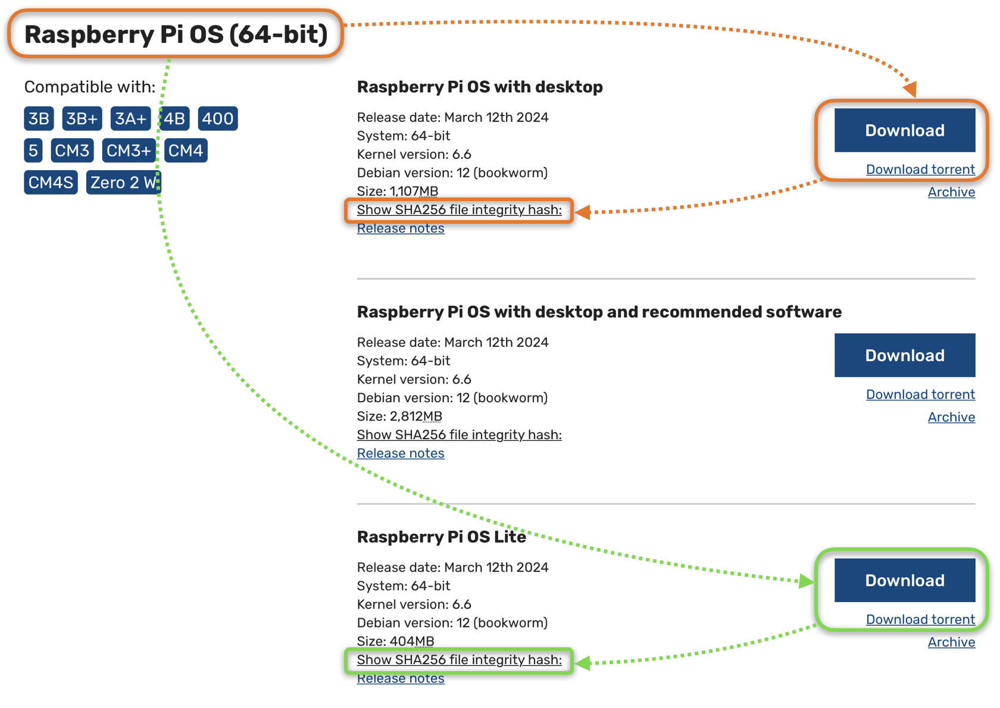

# PiBuilder

<a name="introduction"></a>
## Introduction

This project documents my approach to building Raspberry Pi operating systems to support [SensorsIot/IOTstack](https://github.com/SensorsIot/IOTstack).

Design goals:

1. To have a reliable, repeatable and auditable approach to building Raspberry Pi OS, primarily as a support platform for [SensorsIot/IOTstack](https://github.com/SensorsIot/IOTstack).
2. As far as possible, to favour **speed** over any need for interaction during the build process.
3. All work done "headless" via ssh.
4. To have all IOTstack prerequisites satisfied so there is no need for the menu or other IOTstack scripts to be installing docker, docker-compose, and so on. 

PiBuilder can't possibly be a "one size fits all" for all possible Raspberry Pi configurations. Of necessity, the scripts and supporting files implement *my* decisions and assumptions. You will almost certainly need to make adjustments for your own situation. I have tried to make allowances for that by providing a patching system that is flexible and extensible.

I have tested PiBuilder on:

* Raspberry Pi 3B+, 4B and Zero W2 hardware
* 32-bit versions of Raspberry Pi OS (aka Raspbian) Buster and Bullseye
* 64-bit version of Raspberry Pi OS Bullseye
* 64-bit version of Debian Bullseye running in an [AMD64](https://www.debian.org/distrib/netinst) guest system under Parallels
* 64-bit version of Debian Bookworm running in an [AMD64](https://www.debian.org/distrib/netinst) guest system under Proxmox&nbsp;VE (see [tutorial](./docs/running-on-proxmox-debian.md))
* 64-bit version of Ubuntu Bookworm running in an [AMD64](https://www.debian.org/distrib/netinst) guest system under Proxmox&nbsp;VE

The scripts are written in `bash` and there is a reasonable chance that they will work on any Debian- or Ubuntu-based system. Any steps which have a specific dependency on the Raspberry Pi are skipped. Please see [Running on other platforms](./docs/running-on-other-platforms.md) for more information.


<a name="toc"></a>
## Contents

- [About placeholders](#replaceme)
- [Definitions](#definitions)
- [The Build Process](#buildProcess)

	- [Download Raspberry Pi Imager](#downloadImager)
	- [Download Raspberry Pi OS image](#chooseOSForImager)
	- [Transfer Raspberry Pi OS to SD or SSD](#burnImage)
	- [Boot your Raspberry Pi](#bootRPi)
	- [Connect to your Raspberry Pi using SSH](#connectRPiSSH)
	- [Clone PiBuilder onto your Raspberry Pi](#clonePiBuilder)
	- [Run the PiBuilder scripts in order](#runScripts)

		- [Script 01](#runScript01)
		- [Script 02](#runScript02)
		- [Script 03](#runScript03)
		- [Script 04](#runScript04)
		- [Script 05](#runScript05)

	- [Your system is ready](#rockNroll)

- [Resources](#relatedResources)

<a name="replaceme"></a>
## About placeholders

Guillemets (the characters <kbd>«</kbd> and <kbd>»</kbd>&nbsp;) are used throughout this documentation to indicate placeholders where you should substitute actual values. The most common patterns are:

* **without** other forms of surrounding quote mark. Example:

	```
	$ ssh «user»@«hostname»
	```

	This syntax means you should replace the entire placeholder, including the guillemets, with the actual value:

	```
	$ ssh pi@iot-hub
	```

* **with** other forms of surrounding quote mark. Example:

	```
	$ git add "«filename»" 
	```

	This means you should replace the entire placeholder, including the guillemets, with the actual value, while retaining the surrounding quote marks:
	
	```
	$ git add "resolvconf.patch@iot-hub" 
	```

<a name="definitions"></a>
## Definitions

* "your Raspberry Pi" means the Raspberry Pi device for which you are building an operating system using PiBuilder.
* "«hostname»" is a [placeholder](#replaceme) meaning "the name you chose for your Raspberry Pi".
* "«username»" is a [placeholder](#replaceme) meaning "the account name you use to login to your Raspberry Pi".
* "your support host" means the system from which you connect to your Raspberry Pi using SSH. It will usually be a Mac or PC.

<a name="buildProcess"></a>
## The Build Process

This process is intended for first-time users. No configuration is required. The end point is a system with IOTstack and all dependencies installed. You can either start building a Docker stack using the IOTstack menu or restore an IOTstack backup.

<a name="downloadImager"></a>
### Download Raspberry Pi Imager

Follow the instructions at [Raspberry Pi Imager](https://www.raspberrypi.com/software/) to download and install the Raspberry Pi Imager application onto your support machine.

<a name="chooseOSForImager"></a>
### Download Raspberry Pi OS image

The most recent Raspberry Pi OS can always be found at:

* [https://www.raspberrypi.com/software/operating-systems](https://www.raspberrypi.com/software/operating-systems/)

I always start from "64-bit Raspberry Pi OS with desktop" so that is what I recommend. At the time of writing, that was:



Images for the Raspberry Pi are downloaded as `.xz` files (previously these were `.zip` files). You have the choice of:

1. downloading the image *directly* via the <kbd>Download</kbd> button; or
2. downloading the image *indirectly* by clicking the "Download torrent" link.

It is always a good idea to check the SHA256 signature on each image. It gives you assurance that the image has not been tampered with and wasn't corrupted during download. The magic incantation is:

``` bash
$ SIGNATURE=«hash»
$ IMAGE=«pathToDownloadedFile»
$ shasum -a 256 -c <<< "$SIGNATURE *$IMAGE"
```

You get the «hash» by clicking the `Show SHA256 file integrity hash` link. Here's an example run. It assumes the `.xz` fule

``` bash
$ SIGNATURE=e7c0c89db32d457298fbe93195e9d11e3e6b4eb9e0683a7beb1598ea39a0a7aa
$ IMAGE=2023-05-03-raspios-bullseye-arm64.img.xz
$ shasum -a 256 -c <<< "$SIGNATURE *$IMAGE"
2023-05-03-raspios-bullseye-arm64.img.xz: OK
```

If you don't see "OK", start over!

> If your first attempt was a *direct* download of the image, consider trying the *indirect* method using a torrent.

<a name="burnImage"></a>
### Transfer Raspberry Pi OS to SD or SSD

The steps are:

1. Connect your media (SD or SSD) to your support host (eg Mac/PC). 
2. Launch Raspberry Pi Imager.
3. Click <kbd>CHOOSE OS</kbd>.
4. Scroll down and choose "Use custom".
5. Select the `.xz` (or `.zip`) you downloaded earlier.
6. Click <kbd>CHOOSE STORAGE</kbd>
7. Select the media connected in step 1. *Be careful with this step!*
8. Click the "gear" icon at the bottom, right of the window to open the "Advanced options" panel:

	

	Unless you have good reasons to do otherwise, I recommend:

	- Open the "Image customization options" popup menu &#x1F1E6; and choose "to always use". If you select that option then all of your settings will be remembered across launches of Raspberry Pi Imager. In other words, you will only have to configure Raspberry Pi Imager **once**.

	- Enable &#x1F1E7;, then enter a name for your host at <a name="firstBootHostName"></a>&#x1F1E8;.

		I **strongly** recommend using the name "raspberrypi" (one word, all lower-case) in this panel, and then changing the name later when you run the first PiBuilder script. These instructions assume you accept this advice.

		However, if you decide to choose a unique name for your host in this panel, then:

		1. You need to follow the rules for domain names:

			- letters ("a".."z", "A".."Z") but lower case is recommended
			- digits ("0".."9")
			- hyphen ("-") **not** underscore

		2. You will have to remember to come back into this panel each time you run Raspberry Pi Imager.

	- Enable &#x1F1E9; and &#x1F1EA;. This turns on SSH access.
	- Enable &#x1F1EB;, then:

		- Enter a username at &#x1F1EC;. You can either stick with the traditional "pi" user or choose a different name. It is tricky to change the username once a system has been built so, if you don't like "pi", you should change it now.

			The choice you make here will become the username for *all* of your Raspberry Pis. If you want a different username for each of your Raspberry Pis then you will have to remember to come back into this panel each time you run Raspberry Pi Imager.

			This documentation uses "«username»" to represent the choice you make here.

		- Set a strong password at <a name="firstBootUserPassword"></a>&#x1F1ED;. Please don't use the old default password of "raspberry". Although your user password is easy to change later, the PiBuilder 01 script no longer does that for you because it assumes you have already chosen a strong password.

	- If you want the Raspberry Pi's WiFi interface to be active, enable &#x1F1EE;, then:

		- enter your WiFi network name in &#x1F1EF;.
		- enter your WiFi password in &#x1F1F0;.
		- use the popup menu &#x1F1F1; to select your country code.

			> Your support host may pre-populate some or all of these fields.

	- Enable &#x1F1F2; and then use the popup menus &#x1F1F3; and &#x1F1F4; to set appropriate values.
	- Enable &#x1F1F5;.
	- Click <kbd>SAVE</kbd> (&#x1F1F6;) to save your settings.

9. Click <kbd>WRITE</kbd> and respond to any system prompts to transfer the prepared image to your media.

<a name="bootRPi"></a>
### Boot your Raspberry Pi

Transfer the media to your Raspberry Pi and apply power.

A Raspberry Pi normally takes 20-30 seconds to boot. However, the first time you boot from a clean image it takes a bit longer (a minute or so). The longer boot time is explained by one-time setup code, such as generating host keys for SSH and expanding the root partition to fully occupy the available space on your media (SD or SSD). Be patient.

You will know your Raspberry Pi is ready when it starts responding to pings:

``` bash
$ ping -c 1 raspberrypi.local
```

Notes:

* The name `raspberrypi` assumes you accepted the advice at [set hostname](#firstBootHostName). If you chose a different name, you will need to substitute that here.
* The `.local` domain is reserved for multicast DNS and will be reachable on any available interface (Ethernet and/or WiFi).

<a name="connectRPiSSH"></a>
### Connect to your Raspberry Pi using SSH

1. *On your support host:*

	When your Raspberry Pi responds to pings, connect to it like this:

	``` bash
	$ ssh-keygen -R raspberrypi.local
	$ ssh «username»@raspberrypi.local
	```

	Note:

	* The `ssh-keygen` command is protective and removes any obsolete information from your "known hosts" file. Ignore any errors.

	Normally, SSH will issue a challenge like this:

	```
	The authenticity of host '«description»' can't be established.
	ED25519 key fingerprint is SHA256:gobbledegook/gobbledegook.
	Are you sure you want to continue connecting (yes/no)? 
	```

	This is sometimes referred to as <a name="tofudef"></a>the TOFU (Trust On First Use) pattern. Respond with:

	```
	yes
	```

	Your Raspberry Pi will ask for the password for the user «username». Respond with the password you set in [Raspberry Pi Imager](#firstBootUserPassword).

<a name="clonePiBuilder"></a>
### Clone PiBuilder onto your Raspberry Pi

Once you are logged-in to your Raspberry Pi, clone the PiBuilder repository:


``` bash
$ git clone https://github.com/Paraphraser/PiBuilder.git ~/PiBuilder
```

<a name="runScripts"></a>
### Run the PiBuilder scripts in order

<a name="runScript01"></a>
#### Script 01

1. *On your Raspberry Pi:*

	If you accepted the advice at [set hostname](#firstBootHostName), your Raspberry Pi's name will be `raspberrypi`. Now you should select a unique name for your Pi.

	> Because it is adopted by multicast DNS, any name you choose must follow the DNS rules: lower-case letters, digits and hyphens (no underscores). The script enforces these rules by sanitising any non-compliant name.

	You change your host's name by passing the new «hostname» as an argument to this script. The curly braces indicate that the `{«hostname»}` argument is **optional**. If you omit it, your host will retain its current name.

	> Omitting the argument would be appropriate if you already chose a unique name using [Raspberry Pi Imager](#firstBootHostName), or if you are using PiBuilder in a non-Raspberry Pi environment such as a Debian or Proxmox&nbsp;VE installation where the hostname may have been set via other means.

	Run the first script:

	``` bash
	$ ~/PiBuilder/boot/scripts/01_setup.sh {«hostname»}
	```
	
	Examples:
	
	* change the host name:

		``` bash
		$ ~/PiBuilder/boot/scripts/01_setup.sh iot-hub
		```
		
	* retain the existing host name:

		``` bash
		$ ~/PiBuilder/boot/scripts/01_setup.sh
		```

	The 01 script runs to completion and reboots your Raspberry Pi. Rebooting disconnects your SSH session, returning you to your support host.

	Note:

	* The 01 script forces your Raspberry Pi's boot mode to "console". You may notice this change if you have an external screen connected your Pi. It is the expected behaviour. See [VNC + console + PiBuilder](./docs/vnc.md) if you want to understand the reason for this.

3. *On your support host:*

	If the last part of the 01 script prompts you to do so, run the command:

	``` bash
	$ ssh-keygen -R raspberrypi.local 
	```

	A normal reboot takes about 30-40 seconds. Sometimes, Raspberry Pis hang during this reboot. The most common symptoms are:

	* Your Raspberry Pi responds to pings; but
	* You are unable to connect via SSH ("Connection refused").

	If this happens, you should remove power from your Raspberry Pi, turn it on again, and wait for it to start responding to pings.

<a name="runScript02"></a>
#### Script 02

1. *On your support host:*

	You will know your Raspberry Pi is ready when it starts responding to pings:

	``` bash
	$ ping -c 1 «hostname».local
	```

	Connect and login:

	``` bash
	$ ssh -4 «username»@«hostname».local
	```

	Notes:
	
	* If you see the [TOFU pattern](#tofudef) again, respond with "yes". 	* The `-4` parameter on the `ssh` command instructs SSH to stick to IPv4. The 02 script disables IPv6 as part of its function so forcing IPv4 avoids locking-up the terminal session. 

2. *On your Raspberry Pi:*

	Run:

	``` bash
	$ ~/PiBuilder/boot/scripts/02_setup.sh
	```

	The 02 script runs to completion and reboots your Raspberry Pi.

<a name="runScript03"></a>
#### Script 03

1. *On your support host:*

	Connect and login:

	``` bash
	$ ssh «username»@«hostname».local
	```

2. *On your Raspberry Pi:*

	Run:

	``` bash
	$ ~/PiBuilder/boot/scripts/03_setup.sh
	```

	A common problem with this script is the error "Unable to connect to raspbian.raspberrypi.org". This seems to be transient but it also happens far more frequently than you would like or expect. The script attempts to work around this problem by processing each package individually, while keeping track of packages that could not be installed. Then, if there were any packages that could not be installed, the script:

	- displays a list of the failed packages;
	- invites you to try running the failed installations by hand; and
	- asks you to re-run 03_setup.sh (which will skip over any packages that are already installed).

	Please don't ignore these errors. Prerequisites will be missing if the 03 script does not complete normally. Missing prerequisites will almost certainly prevent PiBuilder from achieving its goal of creating a stable platform for IOTstack. Please keep iterating until the 03 script completes normally.

	Normal completion of the 03 script is signalled with a logout (not a reboot).

<a name="runScript04"></a>
#### Script 04

1. *On your support host:*

	Connect and login:

	``` bash
	$ ssh «username»@«hostname».local
	```

2. *On your Raspberry Pi:*

	Run:

	``` bash
	$ ~/PiBuilder/boot/scripts/04_setup.sh
	```

	The 04 script runs to completion and reboots your Raspberry Pi. This script is where `docker` and `docker-compose` are installed.

<a name="runScript05"></a>
#### Script 05

1. *On your support host:*

	Once your Raspberry Pi comes back, login using:

	``` bash
	$ ssh «username»@«hostname».local
	```

2. *On your Raspberry Pi:*

	Run:

	``` bash
	$ ~/PiBuilder/boot/scripts/05_setup.sh
	```

	The 05 script ends with a logout (not a reboot) so you can login again immediately.

<a name="rockNroll"></a>
### Your system is ready

1. *On your support host:*

	``` bash
	$ ssh «username»@«hostname».local
	```

2. *On your Raspberry Pi:*

	At this point, your Raspberry Pi is ready to run IOTstack. You can either restore a backup or go into the IOTstack menu and start choosing your containers:

	``` bash
	$ cd ~/IOTstack
	$ ./menu.sh
	``` 

3. Once you have restored a backup or completed the menu run, you can bring up your IOTstack with:

	``` bash
	$ cd ~/IOTstack
	$ docker-compose up -d
	```

<a name="relatedResources"></a>
## Resources

* [Change Summary](./CHANGELOG.md)
* [Advanced PiBuilder](./README-ADVANCED.md)

* About:

	- [Supervised Home Assistant](./docs/home-assistant.md)
	- [Running on other platforms](./docs/running-on-other-platforms.md)
	- [SSH](./docs/ssh.md)

* Tutorials:

	- [Domain Name System servers](./docs/dns.md)
	- [Localisation options](./docs/locales.md)
	- [Login profiles)](./docs/login.md)
	- [Running IOTstack on Proxmox VE](./docs/running-on-proxmox-debian.md)
	- [SAMBA](./docs/samba.md)
	- [Static IP addresses](./docs/ip.md)
	- [Syslog - restoring Buster-style rotation](./docs/logrotate.md)
	- [Using local Network Time Protocol servers](./docs/ntp.md)
	- [VNC](./docs/vnc.md)

* Guides:

	- [Installing SQLite](./docs/sqlite.md)
	- [Reinstalling docker and/or docker-compose](./docs/reinstallation.md)
	- [Resetting the IOTstack menu's runtime environment](./docs/reset-menu-environment.md)
