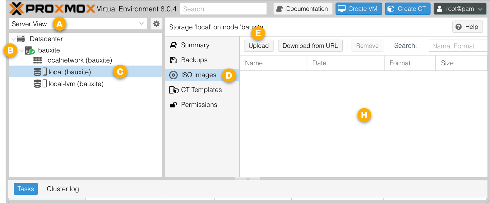
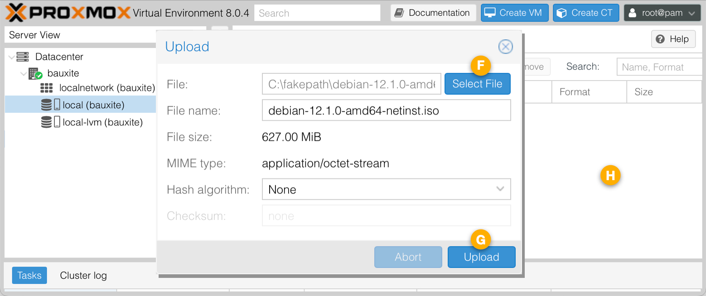
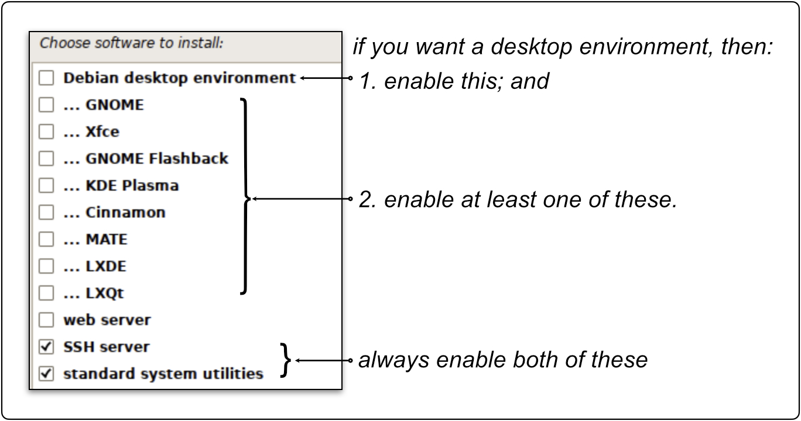

# Proxmox VE + PiBuilder + IOTstack

This tutorial walks you through the process of installing a Debian Bookworm guest system on a Proxmox&nbsp;VE instance, and then using PiBuilder to construct a platform for IOTstack.

## contents

- [Assumptions](#assumptions)
- [Definitions](#definitions)
- [Phase 1 - get installation media](#phaseGetISO)
- [Phase 2 - construct Debian guest](#phaseConstructGuest)
- [Phase 3 - guest configuration](#phaseGuestConfig)

	- [guest pre-configuration](#phaseGuestPreconfig)
	- [guest user configuration](#phaseGuestUserConfig)

- [Phase 4 - clone PiBuilder](#phaseClonePiBuilder)
- [Phase 5 - run PiBuilder scripts](#phaseRunPiBuilder)

	- [Script 01](#runScript01)
	- [Script 02](#runScript02)
	- [Script 03](#runScript03)
	- [Script 04](#runScript04)
	- [Script 05](#runScript05)

- [Phase 6 - running IOTstack](#phaseRunIOTstack)

	- [running the menu](#phaseRunMenu)
	- [migrating IOTstack](#phaseMigrate)

		- [using IOTstackBackup](#phaseMigrateNatural)
		- [using migration assistant](#phaseMigrateAssisted)

- [automating your backups](#backuptip)

- [Home Assistant (Supervised)](#hassio)

<a name="assumptions"></a>
## Assumptions

1. Your hardware platform meets the Proxmox [minimum system requirements](https://www.proxmox.com/en/proxmox-virtual-environment/requirements).
2. You have already [downloaded](https://www.proxmox.com/en/downloads) and installed Proxmox&nbsp;VE on your platform.
3. You are able to use a web browser to connect to the Proxmox&nbsp;VE GUI on port 8006.
4. You are able to login to the Proxmox&nbsp;VE GUI as root.

<a name="definitions"></a>
## Definitions

Wherever you see any «guillemot» delimited placeholders in these instructions, replace the entire placeholder (including the guillemots) with its actual value:

* *placeholder for your Proxmox&nbsp;VE instance:*

	- `«proxmox_root_password»` = the password set for the root user during the installation of the instance.

* *placeholders for your guest system:*

	- `«guest_host»` = the host name given to the guest system (eg `prx-iot`).
	- `«guest_user»` = the account name of the ordinary user set during the installation of the guest (eg `alan`).
	- `«guest_user_password»` = the password for `«guest_user»`.

<a name="phaseGetISO"></a>
## Phase 1 - get installation media

This phase walks you through the process of downloading the installation media for Debian. You only need to complete the steps in this phase once. You will be able to construct any number of Debian Guest systems from the same installation media.

1. Use your web browser to open [https://www.debian.org](https://www.debian.org).
2. Click "Download". Your browser should begin downloading the latest Debian installer onto your support host (Linux, macOS, Windows). The file will have a name like `debian-12.8.0-amd64-netinst.iso`. This is generally referred to as *an `.iso`,* indicating that the file is in ISO9660 (Optical Disc) format. 
3. Use your web browser to:

	* Connect to your Proxmox&nbsp;VE instance on port 8006
	* Login as root

	Then. by reference to the screen-shot below:

	

	* Select the "Server View" <!--A-->&#x1F130;
	* Select your server by name <!--B-->&#x1F131; (the server in this example is named "bauxite")
	* If the hierarchy is not expanded, expand it by clicking the &#xFE65; so it turns into &#x22C1; 
	* Select the "local" storage option <!--C-->&#x1F132;
	* Select the "ISO Images" grouping <!--D-->&#x1F133;
	* Click the "Upload" button <!--E-->&#x1F134;

	In the file selection dialog that opens:

	

	* Click the "Select File" button <!--F-->&#x1F135;
	* Use the file picker to select the `.iso` you downloaded from [https://www.debian.org](https://www.debian.org).

		> Ignore the `C:\fakepath` in the dialog

	* Click the "Upload" button <!--G-->&#x1F136;
	* The uploaded file will appear in the list <!--H-->&#x1F137;.

<a name="phaseConstructGuest"></a>
## Phase 2 - construct Debian guest

This phase walks you through the process of creating a Debian guest system. You can construct any number of Debian Guest systems from the installation media downloaded in the [previous phase](#phaseGetISO).

<a name="createVirtualMachine"></a>

1. Use your web browser to:

	* Connect to your Proxmox&nbsp;VE instance on port 8006
	* Login as root
	* Select the "Pool View" <!--J-->&#x1F139;
	* Click "Create VM" <!--K-->&#x1F13A;

	> Ignore reference points <!--L-->&#x1F13B;, <!--M-->&#x1F13C; and <!--N-->&#x1F13D;; we will come to those later. 

2. In the "Create Virtual Machine" dialog, work through the tabs in order, clicking <kbd>Continue</kbd> at the end of each:

	* "General" tab:

		- <a name="setGuestName"></a>"Name" field: enter a name for your guest (eg "prx-iot")

	* "OS" tab:

		- "ISO image" popup menu: select `debian-12.8.0-amd64-netinst.iso`

		This is the image you downloaded in the [previous phase](#phaseGetISO).

	* "System" tab:

		- "Qemu Agent" checkbox: enable.

	* "Disks" tab:

		- "Disk size (GiB)" field: the default is 32GB which is usually sufficient but you can adjust it as you see fit.
		- "Discard" checkbox: enable this if your underlying physical storage media is a Solid State Disk (SSD).

	* "CPU" tab:

		- "Cores" field: this defaults to a single core. At least two cores are recommended.

	* "Memory" tab:

		- "Memory (MiB)" field: this defaults to 2048MB. At least 4096MB is recommended.

	* "Network" tab:

		- accept all defaults

	* "Confirm" tab:

		- Click <kbd>Finish</kbd>

3. Click the newly-created guest <!--L-->&#x1F13B; to select it.
4. Click the "Console" <!--M-->&#x1F13C; to select the guest's console.
5. Click the "Start Now" button <!--N-->&#x1F13D;.
6. The guest will boot from the installation `.iso`:

	* Choose "Graphical install" and press <kbd>return</kbd>
	* Respond as appropriate to the screens:

		* "Select a language"
		* "Select your location"
		* "Configure the keyboard". Here's a tip from Andreas Spiess:

			> Correct selection of your keyboard is **essential**. Otherwise, password entry might not work as you expect. For example, the German keyboard has <kbd>Y</kbd> and <kbd>Z</kbd> switched. You do not see your password as you type so you think it contains a Y but it's actually a Z.

	* "Configure the network":

		* <a name="setHostName"></a>At "Please enter the host name for this system", choose an appropriate name for this virtual `«guest_host»`.

			Notes:

			1. Your DHCP server may suggest a host name but you will almost certainly want to change it.
			2. You can use letters (all lower case by convention), digits and dashes. For example "prx-iot".
			3. The name you choose here can be the *same* as the one you chose in the [General](#setGuestName) tab of the Create Virtual Machine dialog, or it can be *different*.
			4. The name you choose **here** is the name by which your guest system will be known. For example, if you choose "prx-iot" then the `$HOSTNAME` variable of your guest will be `prx-iot` and the guest system will be reachable via the multicast DNS name of `prx-iot.local`.

		* At "Domain name", enter a domain name (if appropriate) or leave it blank.

			> Your DHCP server may suggest a domain name.

	* "Set up users and passwords":

		* <a name="noRootPassword"></a>**Leave both root password fields empty**.

			Key points:

			1. If you accept this advice and do not assign a root password then the user you create in the next step will be given the ability to run `sudo`. This is similar to the privileges given to the default `pi` user on a Raspberry Pi. These instructions assume you accept this advice.
			2. If you ignore this advice and decide to assign a root password anyway then you should stop following these instructions.

		* <a name="setFullUserName"></a>At "Full name for the new user", enter the full (long) username for `«guest_user»` (eg "Alan Turing").
		* <a name="setShortUserName"></a>At "Username for your account", either accept the default or enter a (short) username for `«guest_user»` (eg "alan").
		* At "Choose a password for the new user", set and confirm a `«guest_user_password»`.

	* "Configure the clock":

		* At "Select the state or province to set your timezone", make an appropriate choice.

	* "Partition Disks":

		* At "Partitioning method", choose "Guided - use entire disk".
		* At "Select disk to partition", accept the default.
		* At "Partitioning scheme", accept the recommendation of all files in one partition.
		* Leave "Finish partitioning and write changes to disk" selected.
		* At "Write the changes to disks?", select "yes".

7. The installer will copy the base system from the `.iso` to the allocated (virtual) partition.
8. At "Scan extra installation media?", leave the default at "No".
9. "Configure the package manager":

	* "Debian archive mirror country", select a nearby mirror.
	* "Debian archive mirror", either accept the default or select an appropriate alternative.
	* If you need to set up a proxy, enter the details; otherwise leave the field blank.

10. Respond to the "popularity contest" question as you think appropriate.
11. In the "Software selection" panel:

	

	- <a name="consoleonly"></a>"Debian desktop environment": You have two choices:

		1. **Either** leave this enabled and choose one or more of the windowing environments (eg GNOME):

			* The installation takes longer and occupies more space on the virtual disk (~3GB);
			* The resulting guest boots into a windowing environment but you have the ability to instruct the system to boot to the console;
			* Network Manager is installed and configured; and
			* The Avahi daemon (multicast DNS) is installed and configured.

		2. **Or** disable the desktop environment entirely. To be specific, that means disabling both the "Debian Desktop Environment" option and disabling **all** windowing-environment options:
			
			* The installation is *significantly* faster and uses less space;
			* The resulting guest boots to the console (there is no ability to switch to a Desktop environment);
			* Network Manager is not installed; and
			* The Avahi daemon (multicast DNS) is not installed.

		If your goal is to construct a server-class system for running IOTstack then I recommend disabling the desktop environment. However, if you need a user-class system which also happens to run IOTstack as a service then leaving the desktop environment enabled may be more appropriate. Your system, your rules!
		
		If you are worried that you might not fully understand the distinction between *server-class* and *user-class*, or if you simply can't make up your mind, then I **strongly** recommend you opt for the server-class system. It is almost always the correct decision.

	- enable "SSH server". This is **important.** Please do not skip this step.

12. The installer will install your selected software.
13. "Install the GRUB boot loader":

	- At "Install the GRUB boot loader to your primary drive?", accept "Yes" (the default).
	- At "Device for boot loader installation", select `/dev/sda`.

14. At "Installation complete", ignore the reminder to remove the installation media. Proxmox&nbsp;VE handles this automatically.
15. Your system will reboot. There is no need to respond to any of the boot-time prompts. Eventually, you will see a login prompt. The type of prompt will depend on whether you [chose a desktop or console](#consoleonly) environment. Either way, you will be able to login using the credentials you set [earlier](#setFullUserName).

<a name="phaseGuestConfig"></a>
## Phase 3 - guest configuration

<a name="phaseGuestPreconfig"></a>
### guest pre-configuration

This pre-configuration step is only needed if you [elected to run from the console](#consoleonly). If you enabled one or more of the Desktop options, you can jump straight to [guest user configuration](#phaseGuestUserConfig).

A limitation of the Proxmox&nbsp;VE console window for a guest is that copy and paste doesn't work so you will need to enter commands by hand:

1. In the [Proxmox-VE GUI](#createVirtualMachine), select your guest <!--L-->&#x1F13B; and click the console <!--M-->&#x1F13C;.
2. Login using the console window <!--N-->&#x1F13D;. Remember to use the `«guest_user»` [credentials](#setShortUserName) you set earlier. There is no `root` account!
3. Get a privileged shell:

	``` console
	$ sudo -s
	```

	You will be asked to re-enter your login password. The prompt will change to `#` to indicate that you are running as `root`.

4. Run the following commands: 

	``` console
	# apt update
	# apt install -y network-manager avahi-daemon
	# systemctl restart ssh
	```

	The `avahi-daemon` provides multicast Domain Name Services (mDNS). After this, the guest system will respond to the name `«guest_host».local`.

5.	Finish off by pressing <kbd>control</kbd>+<kbd>d</kbd> twice to exit the privileged shell and the console session.

<a name="phaseGuestUserConfig"></a>
### guest user configuration

Although these commands *could* be executed from the guest console or a Terminal session opened in the Desktop windowing environment, you would need to type each command by hand. A limitation of the NoVNC interface prevents you from using clipboard services to paste commands into the guest. That's error-prone and, for that reason, the remainder of these instructions assume you will be working via SSH.

Open a Terminal window on your support host (eg your Mac/PC). From the Terminal window:

1. Ensure your SSH "known hosts" file is in a predictable state:

	``` console
	$ ssh-keygen -R «guest_host».local
	```

	You may get an error from this command. That's OK. It's simply a protective measure.

2. Login to the guest system:

	``` console
	$ ssh «guest_user»@«guest_host».local
	```

	You should expect to see the "trust on first use" (aka TOFU) challenge ("The authenticity of host … can't be established"). Respond with "yes" and press <kbd>return</kbd>.

	Supply the `«guest_user_password»` when prompted.

	Note:

	* You can't use SSH to login to the `«guest_host»` as root. You must connect using the `«guest_user»` username.

3. Confirm that you can execute commands using `sudo`:

	``` console
	$ sudo echo "hello"
	```

	Supply the `«guest_user_password»` when prompted.

	Note:

	* If you are not able to execute commands using `sudo`, it probably means that you set a password for the root user, even though the [instructions](#noRootPassword) advised against doing that. Your best course of action is to destroy this guest system and start again.

4. This step is only needed if you [elected to run from the console](#consoleonly). Skip to the [next step](#phaseGuestConsole) if you enabled any of the Desktop options. Otherwise, run the following commands:

	``` console
	$ ip link show
	$ nmcli conn show
	```

	The output from the first command will be something like this:

	```
	1: lo: <LOOPBACK,UP,LOWER_UP> mtu 65536 qdisc noqueue state UNKNOWN mode DEFAULT group default qlen 1000
	    link/loopback 00:00:00:00:00:00 brd 00:00:00:00:00:00
	2: ens18: <BROADCAST,MULTICAST,UP,LOWER_UP> mtu 1500 qdisc fq_codel state UP mode DEFAULT group default qlen 1000
	    link/ether bc:24:11:c7:58:1e brd ff:ff:ff:ff:ff:ff
	    altname enp0s18
	```

	The output from the second command will be something like this:

	```
	NAME  UUID                                  TYPE      DEVICE 
	lo    1a328f3f-8f60-4249-9355-c9181202b97b  loopback  lo     
	```

	Taken together, the output from `ip link` shows that Proxmox-VE has defined a (virtual) PHY (OSI Layer 1 physical interface) named `ens18`, while the output from `nmcli` shows that Network Manager is not in control of that interface. It is better to let Network Manager control your interfaces so this problem should be fixed.

	Typically, a Proxmox-VE guest only has a single networking interface and `ens18` appears to be the default name, so the command you are most likely to need to run is:

	``` console
	$ sudo sed -i.bak -e '/ens18/ s/^/#/' /etc/network/interfaces
	```

	However, if the output from `ip link show` identifies:

	* A **different** interface name then you should edit the command accordingly. For example, if the interface was named `ens20` then the command would be:

		``` console
		$ sudo sed -i.bak -e '/ens20/ s/^/#/' /etc/network/interfaces 
		```

	* **multiple** interfaces (other than `lo`) then you repeat the `-e «script»` syntax. For example, if two interfaces `ens18` and `ens19` were displayed, then the command would be: 

		``` console
		$ sudo sed -i.bak -e '/ens18/ s/^/#/' -e '/ens19/ s/^/#/' /etc/network/interfaces 
		```

	Once `sed` has edited `/etc/network/interfaces`, you need to make Network Manager aware of the change, like this:

	``` console
	$ sudo systemctl restart NetworkManager.service
	```

5. <a name="phaseGuestConsole"></a>This is an optional step. If the font size in the Proxmov-VE console is too small to read comfortably, you can exercise *some* control over that by running:

	``` console
	$ sudo dpkg-reconfigure console-setup
	```

	Good choices are `UTF-8` (default), `Latin 1 & 5` (default), `TerminusBold`, then whatever character size you like.

6. Run the following commands, one at a time:

	``` console
	$ echo "$USER  ALL=(ALL) NOPASSWD:ALL" | sudo tee "/etc/sudoers.d/$USER" >/dev/null
	$ sudo usermod -G adm -a $USER
	$ sudo reboot
	```

	Explanation:

	1. The first line gives the current user the ability to execute `sudo` commands without needing a password.
	2. The second line adds the current user to the `adm` group (administration).
	3. The reboot is needed for some of the earlier commands to take effect.
 
 	After the reboot, `«guest_user»` will have exactly the same privileges as the default `pi` user on a Raspberry Pi and, in particular, the ability to run `sudo` commands without a password prompt.

<a name="phaseClonePiBuilder"></a>
## Phase 4 - clone PiBuilder

1. Login to the guest system:

	``` console
	$ ssh «guest_user»@«guest_host».local
	```

	Supply the `«guest_user_password»` when prompted.

2. Verify that the user has the ability to run `sudo` **without** a password:

	``` console
	$ sudo echo "hello"
	```

	> If you are prompted for a password to run the `sudo` command, go back to the [previous phase](#phaseGuestUserConfig) and check your work.

3. Clone PiBuilder:

	``` console
	$ sudo apt update ; sudo apt install -y git
	$ git clone https://github.com/Paraphraser/PiBuilder.git ~/PiBuilder
	```

	> If you have customised a clone of PiBuilder which you want to use rather than the version on GitHub, adapt the URL appropriately.

4. Logout (<kbd>control</kbd>+<kbd>d</kbd>).

Tip:

* If you wish to use Proxmox's facilities to take a snapshot of your guest OS before you start running the PiBuilder scripts, this is the place to do it.

<a name="phaseRunPiBuilder"></a>
## Phase 5 - run PiBuilder scripts

<a name="runScript01"></a>
### Script 01

1. Login to the guest:

	``` console
	$ ssh «guest_user»@«guest_host».local
	```

2. Run the first script:

	``` console
	$ ./PiBuilder/boot/scripts/01_setup.sh
	```

	There is no need to pass the `«guest_host»` argument to this script. You already entered the name for this host at ["Please enter the host name for this system"](#setHostName).

	Note:

	* If you elected to install the [Debian desktop](#consoleonly) and one or more windowing environments then a side-effect of the 01 script is to boot the Proxmox-VE guest to the console. If you want to re-enable the Desktop login, run the following command:

		``` console
		$ sudo systemctl set-default graphical.target
		```

		If you subsequently decide to boot to the console, run:

		``` console
		$ sudo systemctl set-default multi-user.target
		```

		Both commands take effect on the next reboot.

<a name="runScript02"></a>
### Script 02

1. Login to the guest:

	``` console
	$ ssh -4 «guest_user»@«guest_host».local
	```

2. Run the second script:

	``` console
	$ ./PiBuilder/boot/scripts/02_setup.sh
	```

<a name="runScript03"></a>
### Script 03

1. Login to the guest:

	``` console
	$ ssh «guest_user»@«guest_host».local
	```

	> The previous 02 script disabled IPv6 so there is no further need to use the `-4` option.

2. Run the third script:

	``` console
	$ ./PiBuilder/boot/scripts/03_setup.sh
	```

<a name="runScript04"></a>
### Script 04

1. Login to the guest:

	``` console
	$ ssh «guest_user»@«guest_host».local
	```

2. Run the fourth script:

	``` console
	$ ./PiBuilder/boot/scripts/04_setup.sh
	```

<a name="runScript05"></a>
### Script 05

1. Login to the guest:

	``` console
	$ ssh «guest_user»@«guest_host».local
	```

2. Run the fifth script:

	``` console
	$ ./PiBuilder/boot/scripts/05_setup.sh
	```

Tip:

* If you wish to use Proxmox's facilities to take a snapshot of your guest OS before you start doing anything with IOTstack, this is the place to do it.

<a name="phaseRunIOTstack"></a>
## Phase 6 - running IOTstack

At this point, you have two choices:

* if you are just getting started with IOTstack, go to [running the menu](#phaseRunMenu).
* if you intend to migrate an existing IOTstack installation to your Debian guest, go to [migrating IOTstack](#phaseMigrate).

<a name="phaseRunMenu"></a>
### running the menu 

1. Login to the guest:

	``` console
	$ ssh «guest_user»@«guest_host».local
	```

2. Change your working directory:

	``` console
	$ cd ~/IOTstack
	```

3. Initialise your time-zone:

	``` console
	$ echo "TZ=$(cat /etc/timezone)" >>.env
	```

	This copies the timezone for your Debian guest into the file `~/IOTstack/.env`, which makes it available to any containers which define their `TZ` variables like this:

	``` yaml
	- TZ=${TZ:-Etc/UTC}
	```

	That statement says "if `TZ` is defined in `.env` then use its value, otherwise default to `Etc/UTC`. It is an effective way of making sure all containers that support `TZ` run on the same timezone as your operating system and saves you the trouble of editing the same environment variable in each service definition.

4. Run the menu and choose your containers:

	``` console
	$ ./menu.sh
	```

	The first time you run the menu, there will be a delay while the script constructs a virtual environment for Python.

5. Bring up your stack:

	``` console
	$ docker-compose up -d
	```

<a name="phaseMigrate"></a>
### migrating IOTstack

Have you been using [IOTstackBackup](https://github.com/Paraphraser/IOTstackBackup) to backup your existing IOTstack system?

* if "yes" then go to [using IOTstackBackup](#phaseMigrateNatural)
* if "no" then go to [using migration assistant](#phaseMigrateAssisted)

<a name="phaseMigrateNatural"></a>
#### using IOTstackBackup

In general, you will want to take a backup immediately before you do the migration process so:

1. Login to your old IOTstack system:

	``` console
	$ ssh «user»@«host».local
	```

	where `«host»` is the name of your old IOTstack device, and `«user»` is the username on your old IOTstack device.

2. Run a backup:

	``` console
	$ iotstack_backup
	```

3. <a name="noteRunTag"></a>List your backups directory and use the timestamps embedded in the file names to identify the backup files that were just created. For example:

	```
	2023-09-30_1138.iot-hub.backup-log.txt
	2023-09-30_1138.iot-hub.general-backup.tar.gz
	2023-09-30_1138.iot-hub.influx-backup.tar
	```

	The `«runtag»` is the string comprising the date, time and hostname. In the above, the hostname is "iot-hub" so the «runtag» is:

	```
	2023-09-30_1138.iot-hub
	```

	Make a note of your `«runtag»` because you will need it later. Do not be concerned by the fact that the hostname portion is the name of your old system. It is exactly what you want!

4. Logout from the old system by pressing <kbd>control</kbd>+<kbd>d</kbd>.
5. Login to your newly-created guest system:

	``` console
	$ ssh «guest_user»@«guest_host».local
	```

6. In order to function properly, IOTstackBackup needs the following files to be in place:

	* `~/.config/iotstack_backup/config.yml` (required)
	* `~/.config/rclone/rclone.conf` (optional)

	The `rclone.conf` is only needed if you have been using the RCLONE method (eg your backups are being sent to Dropbox).

	You *can* provide those files to PiBuilder so that they are installed automatically. If you have **not** done that, then you need to fix that problem now, like this:

	1. These steps are required:

		``` console
		$ mkdir -p ~/.config/iotstack_backup
		$ cd ~/.config/iotstack_backup
		$ scp «user»@«host».local:.config/iotstack_backup/config.yml .
		```

		where `«host»` is the name of your old IOTstack device, and `«user»` is the username on your old IOTstack device. You may be prompted to permit the connection, and for a login password.

	2. You only need to do these steps if you have been using the RCLONE method:

		``` console
		$ mkdir -p ~/.config/rclone
		$ cd ~/.config/rclone
		$ scp «user»@«host».local:.config/rclone/rclone.conf .
		```

7. Now you can run the restore:

	``` console
	$ cd
	$ iotstack_restore «runtag»
	```

	where `«runtag»` is the value you [made a note of](#noteRunTag) earlier. For example:

	``` console
	$ iotstack_restore 2023-09-30_1138.iot-hub
	```

	The `iotstack_restore` script will fetch the backup files using your chosen method (SCP, RSYNC or RCLONE) and then invoke subordinate scripts to restore your stack. Once again, do not be concerned by the fact that the hostname portion is the name of your old system. It is exactly what you want!

8. Once the restore completes, you can bring up your stack:

	``` console
	$ cd ~/IOTstack
	$ docker-compose up -d
	```

<a name="phaseMigrateAssisted"></a>
#### using migration assistant

Follow the instructions at [IOTstackBackup migration assistant](https://github.com/Paraphraser/IOTstackBackup?tab=readme-ov-file#migration-assistant).

Note:

* You can also use the migration assistant even if you have IOTstackBackup installed and configured on your old machine. Follow the link to the instructions above, then just skip step 2.

<a name="backuptip"></a>
#### automating your backups

PiBuilder installs [IOTstackBackup](#https://github.com/Paraphraser/IOTstackBackup) and all required dependencies but can't configure it for you. To configure IOTstackBackup you either need to:

* start from scratch and follow the instructions to set up [the configuration file](https://github.com/Paraphraser/IOTstackBackup?tab=readme-ov-file#the-configuration-file); or
* copy an existing configuration file from another host.

Tip:

* PiBuilder's [advanced README](https://github.com/Paraphraser/PiBuilder/blob/master/README-ADVANCED.md#overview) contains an example of how to provide your IOTstackBackup configuration files to PiBuilder so IOTstackBackup is ready to run once PiBuilder finishes.

Once IOTstackBackup is configured, you should consider automating your backups using `cron`. You will find instructions [here](https://github.com/Paraphraser/IOTstackBackup?tab=readme-ov-file#using-cron-to-run-iotstack_backup).

<a name="hassio"></a>
## Home Assistant (Supervised)

If you wish to install Home Assistant on the same Proxmox&nbsp;VE instance, follow the instructions [here](https://community.home-assistant.io/t/installing-home-assistant-os-using-proxmox-8/201835#section-3-installing-home-assistant-os-4). At that link you will find a `bash -c` command which you should copy to the clipboard.

> I am not going to provide the command here because it may change. You should always go to the source!

You can run the command using any method that makes sense in your situation:

1. If you have a keyboard+screen attached to your Proxmox-VE server, you can login and do it from there.

2. You can use the Proxmox-VE web GUI:

	```
	Server view » Datacenter » host » shell
	```

3. You can connect to your Proxmox-VE server using SSH.

Regardless of connection method, if you login as the "root" user then you can paste the `bash -c …` command directly from the clipboard.

However, if you login as a non-root user, you should run the command like this:

1. Obtain a shell as root:

	```
	$ sudo -s
	```

	The system prompt will change to `#` to indicate that you are now root.

2. Paste the `bash -c …` from the clipboard.

3. Exit the root shell by pressing <kbd>control</kbd>+<kbd>d</kbd>

Whichever approach you choose, simply accept the defaults. The result is a running guest instance of Home Assistant.
