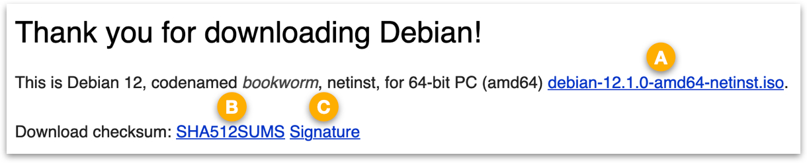
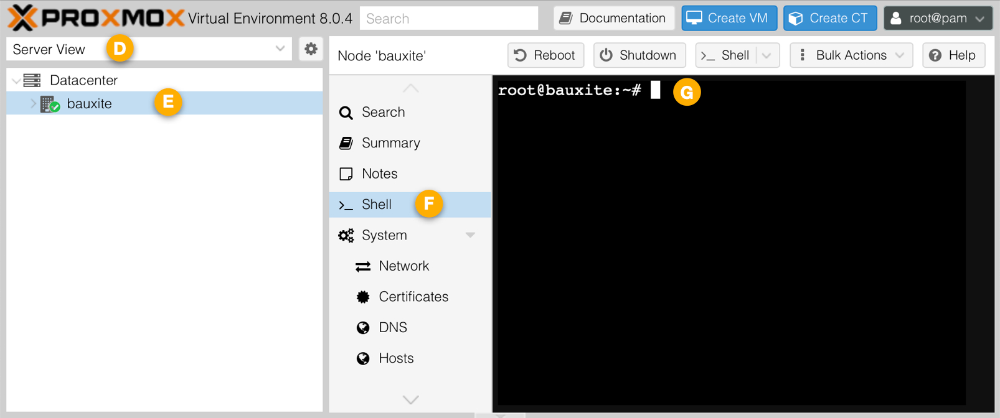

# Proxmox VE + PiBuilder + IOTstack

This tutorial walks you through the process of installing a Debian Bookworm guest system on a Proxmox&nbsp;VE instance, and then using PiBuilder to construct a platform for IOTstack.

## contents

- [Assumptions](#assumptions)
- [Definitions](#definitions)
- [Phase 1 - get installation media](#getISO)

	- [verify installation media](#checkISO)
	- [alternative installation method](#altMethod)

- [Phase 2 - construct Debian guest](#phaseConstructGuest)
- [Phase 3 - guest user configuration](#phaseGuestConfig)
- [Phase 4 - clone PiBuilder](#phaseClonePiBuilder)
- [Phase 5 - run PiBuilder scripts](#phaseRunPiBuilder)

	- [Script 01](#runScript01)
	- [Script 02](#runScript02)
	- [Script 03](#runScript03)
	- [Script 04](#runScript04)
	- [Script 05](#runScript05)

- [Phase 6 - IOTstack is ready](#phaseRunIOTstack)
- [Home Assistant (Supervised)](#hassio)

<a name="assumptions"></a>
## Assumptions

1. Your hardware platform meets the Proxmox [minimum system requirements](https://www.proxmox.com/en/proxmox-virtual-environment/requirements).
2. You have already [downloaded](https://www.proxmox.com/en/downloads) and installed Proxmox&nbsp;VE on your platform.
3. You are able to use a web browser to connect to the Proxmox&nbsp;VE GUI on port 8086.
4. You are able to login to the Proxmox&nbsp;VE GUI as root.

<a name="definitions"></a>
## Definitions

Wherever you see any «guillemot» delimited placeholders in these instructions, replace the entire placeholder (including the guillemots) with its actual value:

* *placeholder for your Proxmox&nbsp;VE instance:*

	- `«proxmox_root_password»` = the password set for the root user during the installation of the instance.

* *placeholders for your guest system:*

	- `«guest_host»` = the host name given to the guest system.
	- `«guest_root_password»` = the password set for the root user during the installation of the guest.
	- `«guest_user»` = the name of the ordinary user set during the installation of the guest.
	- `«guest_user_password»` = the password for `«guest_user»`.

<a name="getISO"></a>
## Phase 1 - get installation media

This phase walks you through the process of downloading the installation media for Debian. You only need to complete the steps in this phase once. You will be able to construct any number of Debian Guest systems from the same installation media.

> These instructions assume you will do the work on your Proxmox&nbsp;VE instance but you can also use a separate system. Just read through the steps below first, and then the [alternative installation method](#altMethod) discussion should make sense.

The steps are:

1. In a text editor window, prepare a command template containing the following three lines:

	```
	ISO_URL=
	SUMS_URL=
	SIGS_URL=
	```

2. Use your web browser to open [https://www.debian.org](https://www.debian.org).
3. Click "Download". You should see something similar to this:

	

4. Right-click the link to the installer (<mark>A</mark>), and copy the URL to the clipboard. Switch to the text editor and paste the URL on the right hand side of `ISO_URL=`.
5. Repeat the right-click, copy-and-paste process for:

	- "SHA512SUMS" (<mark>B</mark>), paste against `SUMS_URL=`
	- "Signature" (<mark>C</mark>), paste against `SIGS_URL=`.

6. At the time of writing (September 2023), the completed command template looked like this:

	```
	ISO_URL=https://cdimage.debian.org/debian-cd/current/amd64/iso-cd/debian-12.1.0-amd64-netinst.iso
	SUMS_URL=https://cdimage.debian.org/debian-cd/current/amd64/iso-cd/SHA512SUMS
	SIGS_URL=https://cdimage.debian.org/debian-cd/current/amd64/iso-cd/SHA512SUMS.sign
	```
	
	You will need the completed template in a few moments.

7. Use your web browser to:

	* Connect to your Proxmox&nbsp;VE instance on port 8006
	* Login as root

	Then:
	
	

	* Select the "Server View" <mark>D</mark>
	* Select your server by name <mark>E</mark> (the server in this example is named "bauxite")
	* Select the "Shell" <mark>F</mark>

8. At the command prompt <mark>G</mark>:

	- change your working directory by running this command:

		```
		# cd /var/lib/vz/template/iso/
		```

	- paste the completed command template you prepared earlier and press <kbd>return</kbd>. The pasted commands set the `ISO_URL`, `SUMS_URL` and `SIGS_URL` environment variables.
	- run this command:

		```
		# wget $SUMS_URL $SIGS_URL $ISO_URL
		```

	Assuming the downloads succeed, the result is three files:

	1. `debian-12.1.0-amd64-netinst.iso` - the Debian installer in ISO9660 (Optical Disc) format;
	2. `SHA512SUMS` a text file containing a list of 512-bit Secure Hashing Algorithm (SHA) hashes for the several `.iso` image variations available for Debian; and
	3. `SHA512SUMS.sign` a GnuPG detached signature file for verifying that the `SHA512SUMS` file has not been tampered with. 

<a name="checkISO"></a>
### verify installation media

Although you can skip this section and jump straight to [construct Debian guest](#phaseConstructGuest), you are encouraged to become familiar with the verification process so you can assure yourself that the `.iso` you have just downloaded is fit for purpose.

1. At the command prompt <mark>G</mark>, attempt to confirm the authenticity of the `SHASUMS` file by verifying the digital signature:

	```
	# gpg --verify SHA512SUMS.sign SHA512SUMS
	```
	
	The three most-likely responses are:
	
	* "Can't check signature: No public key" (most likely if you are doing this for the first time):

		```
		gpg: Signature made Sun 23 Jul 2023 03:04:08 AM AEST
		gpg:                using RSA key DF9B9C49EAA9298432589D76DA87E80D6294BE9B
		gpg: Can't check signature: No public key
		```
		
		In this case, you solve the problem by using the key's fingerprint (the hexadecimal string at the end of the second line) to download the missing public key from a key-server and add it to root's GnuPG keychain:
		
		```
		# gpg --keyserver hkps://keyserver.ubuntu.com:443 --recv DF9B9C49EAA9298432589D76DA87E80D6294BE9B
		```
		
		Then re-try the `gpg --verify` command above.
		
	* "Good signature" (most likely response once the public key has been installed):

		```
		gpg: Signature made Sun 23 Jul 2023 03:04:08 AM AEST
		gpg:                using RSA key DF9B9C49EAA9298432589D76DA87E80D6294BE9B
		gpg: Good signature from "Debian CD signing key <debian-cd@lists.debian.org>" [unknown]
		gpg: WARNING: This key is not certified with a trusted signature!
		gpg:          There is no indication that the signature belongs to the owner.
		```
		
		Seeing "Good signature" means that you can be assured that the detached signature was created using the private key matching the claimed public key **and** that the content of SHA512SUMS has not been modified since the signature was created. You can ignore both the "[unknown]" and the warning, and proceed to step 2.

	* "BAD signature" (possible but fairly unlikely):

		```
		gpg: Signature made Sun 23 Jul 2023 03:04:08 AM AEST
		gpg:                using RSA key DF9B9C49EAA9298432589D76DA87E80D6294BE9B
		gpg: BAD signature from "Debian CD signing key <debian-cd@lists.debian.org>" [unknown]
		```
	
		Seeing "BAD signature" means you should not trust the content of the SHA512SUMS file which, in turn, means you can't be certain that the 512-bit hashes it contains are reliable. You can either download a fresh copy of the SHA512SUMS and re-try the signature verification or you can accept some risk by ignoring the problem and proceeding to the next step.
		
		Note:
		
		* To help you judge the risk, keep in mind that many sites (eg [Raspberry Pi Foundation](https://www.raspberrypi.com/software/operating-systems/)) only publish cryptographic hashes and do not "sign" their hashes. If you routinely use such unsigned hashes to check that the corresponding disk images have not been altered, it is really no different to ignoring a "BAD signature" warning.
		
2. At the command prompt <mark>G</mark>, confirm that there is a cryptographic hash matching the `.iso`:

	```
	# grep debian-12.1.0-amd64-netinst.iso SHA512SUMS | shasum -a 512 -c
	```

	> The `grep` utility searches the `SHA512SUMS` file for the line containing "debian-12.1.0-amd64-netinst.iso". That line, which contains both the expected hash and the filename, is piped to the `shasum` utility which searches the working directory for the named file, recomputes the 512-bit hash, and compares its answer with the expected hash from the `SHA512SUMS` file.

	If the hashes match, you will see:

	```
	debian-12.1.0-amd64-netinst.iso: OK
	```

	This attests that the `debian-12.1.0-amd64-netinst.iso` file has not been altered.

<a name="altMethod"></a>
### alternative installation method

The instructions in this phase explained how to use the shell interface in the Proxmox&nbsp;VE GUI to download the installation media onto your Proxmox&nbsp;VE instance *directly*.

However, there is nothing stopping you from doing the download and verification work on another computer, and then simply copying the `.iso` into the `/var/lib/vz/template/iso/` directory on your Proxmox&nbsp;VE instance.

Downloading on a host where you have personal key(s) installed in your GnuPG keychain gives you the ability to silence the trust warnings by certifying the Debian public key with one of your own private keys. For example:

```
$ PRIVATE_KEY_ID=0x1234567890ABCDEF
$ gpg --local-user $PRIVATE_KEY_ID --lsign-key DF9B9C49EAA9298432589D76DA87E80D6294BE9B
```

> If your private master key is protected with a passphrase, you will be asked to enter it to authorise the operation.

<a name="phaseConstructGuest"></a>
## Phase 2 - construct Debian guest


1. Use your web browser to:

	* Connect to your Proxmox&nbsp;VE instance on port 8006
	* Login as root
	* Select the "Pool View" <mark>H</mark>
	* Click "Create VM" <mark>J</mark>

	> Ignore reference points <mark>K</mark>, <mark>L</mark> and <mark>M</mark>; we will come to those later. 

2. In the "Create Virtual Machine" dialog, work through the tabs in order, clicking <kbd>Continue</kbd> at the end of each:

	* "General" tab:

		- "Name" field: enter a name for your guest (eg "prx-iot")

	* "OS" tab:

		- "ISO image" popup menu: select `debian-12.1.0-amd64-netinst.iso`

		This is the image you downloaded in the [previous phase](#getISO).

	* "System" tab:

		- accept all defaults

	* "Disks" tab:

		- "Disk size (GiB)" field: the default is 32GB which is usually sufficient but you can adjust it as you see fit.
		- "Discard" checkbox: enable this if your underlying physical storage media is a Solid State Disk (SSD).

	* "CPU" tab

		- "Cores" field: this defaults to a single core. At least two cores are recommended.

	* "Memory" tab:

		- "Memory (MiB)" field: this defaults to 2048MB. At least 4096MB is recommended.

	* "Network" tab:

		- accept all defaults

	* "Confirm" tab:

		- Click <kbd>Finish</kbd>

3. Click the newly-created guest <mark>K</mark> to select it.
4. Click the "Console" <mark>L</mark> to select the guest's console.
5. Click the "Start Now" button <mark>M</mark>.
6. The guest will boot from the installation `.iso`:

	* Choose "Graphical install" and press <kbd>return</kbd>
	* Respond as appropriate to the screens:

		* "Select a language"
		* "Select your location"
		* "Configure the keyboard"

	* "Configure the network":

		* <a name="setHostName"></a>At "Please enter the host name for this system", choose an appropriate name for this virtual `«guest_host»`. You can use letters (all lower case by convention), digits and dashes. For example "prx-iot".

			> Your DHCP server may suggest a host name.

		* At "Domain name", choose a domain name (if appropriate).

			> Your DHCP server may suggest a domain name.

	* "Set up users and passwords":

		* Set and confirm a `«guest_root_password»`.
		* <a name="setFullUserName"></a>At "Full name for the new user", enter the full (long) username for `«guest_user»` (eg "Alan Turing").
		* <a name="setShortUserName"></a>At "Username for your account", either accept the default or enter a (short) username for `«guest_user»` (eg "alan").
		* At "Choose a password for the new user", set and confirm a `«guest_user_password»`.

	* "Configure the clock":

		* At "Select the state or province to set your timezone", make an appropriate choice.

	* "Partition Disks":

		* At "Partitioning method", choose "Guided - use entire disk".
		* At "Select disk to partition", accept the default.
		* At "Partitioning scheme", accept the recommendation of all files in one partition.
		* Leave "Finish partitioning and write changes to disk" selected.
		* At "Write the changes to disks?", select "yes".

7. The installer will copy the base system from the `.iso` to the allocated (virtual) partition.
8. At "Scan extra installation media?", leave the default at "No".
9. "Configure the package manager":

	* "Debian archive mirror country", select a nearby mirror.
	* "Debian archive mirror", either accept the default or select an appropriate alternative.
	* If you need to set up a proxy, enter the details; otherwise leave the field blank.

10. Respond to the "popularity contest" question as you think appropriate.
11. At "Software selection":

	- enable "SSH server".
	- choose desktop environments as you prefer.

	Note:

	* Enabling SSH is **important.** Please do not skip this step.

12. The installer will install your selected software.
13. "Install the GRUB boot loader":

	- At "Install the GRUB boot loader to your primary drive?", accept "Yes" (the default).
	- At "Device for boot loader installation", select `/dev/sda`.

14. At "Installation complete", ignore the reminder to remove the installation media. Proxmox&nbsp;VE handles this automatically.
15. Your system will reboot. There is no need to respond to any of the boot-time prompts. Eventually, you will see a screen containing the full username you set [earlier](#setFullUserName).

<a name="phaseGuestConfig"></a>
## Phase 3 - guest user configuration

A limitation of the Proxmox&nbsp;VE console window for a guest is that copy and paste doesn't work. Although it is possible to configure guests to support copy and paste in the console, it's simpler to use SSH.

Note:

* You can't use SSH to login to the `«guest_host»` as root. You must connect using the `«guest_user»` username.

Open a Terminal window on your support host (eg your Mac/PC). From the Terminal window:

1. Login to the guest system:

	```
	$ ssh-keygen -R «guest_host».local
	$ ssh -4 «guest_user»@«guest_host».local
	```

	You should expect to see the "trust on first use" (aka TOFU) challenge ("The authenticity of host … can't be established"). Respond with "yes" and press <kbd>return</kbd>.

	Supply the `«guest_user_password»` when prompted.

2. Become root:

	```
	$ su - root
	#
	```

	Supply the `«guest_root_password»` when prompted.

3. Install git:

	```
	# apt update
	# apt install -y git
	```

4. Copy all of the following text to the clipboard, paste it into the Terminal window, and press <kbd>return</kbd>:

	```
	add_privileges_for_user() {
		echo "$1  ALL=(ALL) NOPASSWD:ALL" >/etc/sudoers.d/$1
		usermod -G sudo -a $1
		usermod -G adm -a $1
	}

	add_privileged_user() {
		adduser --home /home/$1 --shell /bin/bash $1
		add_privileges_for_user $1
	}
	```

5. Replace `«guest_user»` in the first command below with the (short) username [you defined earlier](#setShortUserName), and then run both commands:

	```
	# add_privileges_for_user «guest_user»
	# add_privileged_user admin
	```

	The first command sets your `«guest_user»` account so you can run the `sudo` command without needing a password (ie like the default situation on the Raspberry Pi). Please make sure to use the actual `«guest_user»` name (eg "alan"). You can't use `$USER` because you are running as root!

	The second command defines an "admin" user. This is intended to be a backup administrator. It is a protective account in case you get locked out of your `«guest_user»` account. Choose sensible values when prompted, plus a password you can remember. The `admin` user will also have the ability to run `sudo` without needing a password.

6. Logout as the root user by typing <kbd>control</kbd>+<kbd>d</kbd>. That drops you back to the `«guest_user»` account.
7. Logout as the `«guest_user»` by typing <kbd>control</kbd>+<kbd>d</kbd>. Logging-out from the `«guest_user»` account is required before the privilege changes can take effect.
 
<a name="phaseClonePiBuilder"></a>
## Phase 4 - clone PiBuilder

1. Login to the guest system:

	```
	$ ssh -4 «guest_user»@«guest_host».local
	```

	Supply the `«guest_user_password»` when prompted.

2. Verify that the user has the ability to run `sudo` without a password:

	```
	$ sudo ls
	```

	> If you are prompted for a password to run the `sudo` command, go back to the [previous phase](#phaseGuestConfig) and check your work.

2. Clone PiBuilder:

	```
	$ git clone https://github.com/Paraphraser/PiBuilder.git ~/PiBuilder
	```

	> If you have customised a clone of PiBuilder which you want to use rather than the version on GitHub, adapt the URL appropriately.

3. Logout (<kbd>control</kbd>+<kbd>d</kbd>).

Tip:

* If you wish to use Proxmox's facilities to take a snapshot of your guest OS before you start running the PiBuilder scripts, this is the place to do it.

<a name="phaseRunPiBuilder"></a>
## Phase 5 - run PiBuilder scripts

<a name="runScript01"></a>
### Script 01

1. Login to the guest:

	```
	$ ssh -4 «guest_user»@«guest_host».local
	```

2. Run the first script:

	```
	$ ./PiBuilder/boot/scripts/01_setup.sh
	```
	
	There is no need to pass the `«guest_host»` argument to this script. You already entered the name for this host at ["Please enter the host name for this system"](#setHostName).

<a name="runScript02"></a>
### Script 02

1. Login to the guest:

	```
	$ ssh -4 «guest_user»@«guest_host».local
	```

2. Run the second script:

	```
	$ ./PiBuilder/boot/scripts/02_setup.sh
	```

<a name="runScript03"></a>
### Script 03

1. Login to the guest:

	```
	$ ssh «guest_user»@«guest_host».local
	```

	> The previous 02 script disabled IPv6 so there is no further need to use the `-4` option.

2. Run the third script:

	```
	$ ./PiBuilder/boot/scripts/03_setup.sh
	```

<a name="runScript04"></a>
### Script 04

1. Login to the guest:

	```
	$ ssh «guest_user»@«guest_host».local
	```

2. Run the fourth script:

	```
	$ ./PiBuilder/boot/scripts/04_setup.sh
	```

<a name="runScript05"></a>
### Script 05

1. Login to the guest:

	```
	$ ssh «guest_user»@«guest_host».local
	```

2. Run the fifth script:

	```
	$ ./PiBuilder/boot/scripts/05_setup.sh
	```

Tip:

* If you wish to use Proxmox's facilities to take a snapshot of your guest OS before you start doing anything with IOTstack, this is the place to do it.

<a name="phaseRunIOTstack"></a>
## Phase 6 - IOTstack is ready

1. Login to the guest:

	```
	$ ssh «guest_user»@«guest_host».local
	```

2. The system is now ready for IOTstack. You can:

	* EITHER restore a backup:
	
		```
		$ iotstack_restore «runtag»
		```
	
		Note:
	
		* Your ability to run `iotstack_restore` depends on having set up two files:
	
			- `~/.config/iotstack_backup/config.yml`
			- `~/.config/rclone/rclone.conf`
	
			If you did not configure PiBuilder to do that for you, you will have to copy those two files into place now.
	
	* OR launch the menu like this:
	
		```
		$ cd ~/IOTstack
		$ ./menu.sh
		```

<a name="hassio"></a>
## Home Assistant (Supervised)

If you wish to install Home Assistant on the same Proxmox&nbsp;VE instance, follow the instructions [here](https://community.home-assistant.io/t/installing-home-assistant-os-using-proxmox-8/201835#section-3-installing-home-assistant-os-4).
